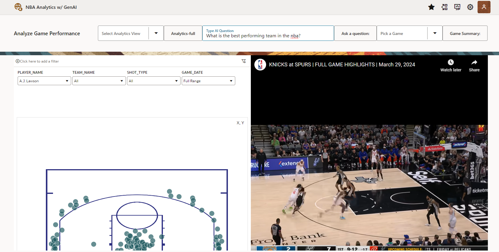

# Introduction

## About this Workshop

If you would like to expand your abilities to deliver and analytics and machine learning technology together
in a compelling and easily digestible to format, this is the right workshop for you.

Generative AI is the hottest topic in machine learning right now, and this lab will go through a compelling NBA performance analysis use case that
shows how GenAI and Analytics can be used alongside each other to improve the ways that analysts learn about the game.

  

This workshop starts with the Autonomous Database, the single source of truth which will house our NBA data. You will build dashboards in Oracle Analytics Cloud (OAC) and enable a Generative AI model to access this data and use it to inform its responses to queries. The dashboards and Generative AI model you set up will then be combined together in a VisualBuilder application where they can be used in tandem.

The target audience for this workshop is analysts, data scientists, and app developers who are interested in finding the best ways to deliver analytics and AI solutions to end users. 

> **NOTE:** Your tenancy must be subscribed to the **US Midwest (Chicago)** region in order to run this workshop. See the [OCI documentation](https://docs.oracle.com/en-us/iaas/Content/Identity/Tasks/managingregions.htm) for more details.

### What is Natural Language?

Natural language processing is the ability of a computer application to understand human language as it is spoken and written. It is a component of artificial intelligence (AI).

### What is Generative AI?

Generative AI enables users to quickly generate new content based on a variety of inputs. Inputs and outputs to these models can include text, images, sounds, animation, 3D models, and other types of data.

### Objectives

In this workshop, you will learn how to:

* Load data in your Autonomous Database
* Visualilze data in Oracle Analytics Cloud
* Import a Visual Builder App
* Connect your data from the database
* Use application to analyze player and team performance with Generative AI

### Prerequisites

* Your tenancy **must be subscribed to the US Midwest (Chicago)** region.
* Basic database and SQL knowledge.
* Familiarity with Oracle Cloud Infrastructure (OCI) is helpful.
* Familiarity with the role of REST services.

You may now **proceed to the next lab**.

## Learn more

* [Oracle Autonomous Database Documentation](https://docs.oracle.com/en/cloud/paas/autonomous-data-warehouse-cloud/index.html)
* [Additional Autonomous Database Tutorials](https://docs.oracle.com/en/cloud/paas/autonomous-data-warehouse-cloud/tutorials.html)
* [Overview of Generative AI Service](https://docs.oracle.com/en-us/iaas/Content/generative-ai/overview.html)
* [Overview of Oracle Analytics Cloud](https://docs.oracle.com/en/cloud/paas/analytics-cloud/index.html)
* [Overview of Visual Builder](https://docs.oracle.com/en/cloud/paas/app-builder-cloud/index.html)

## Acknowledgements

* **Authors:**
	* Nicholas Cusato - Cloud Engineer
	* Malia German - Cloud Engineer
	* Miles Novotny - Cloud Engineer
* **Last Updated by/Date** - Nicholas Cusato, August 2024

Data about the NBA in this workshop were sourced from [nba.com](https://www.nba.com/)

Copyright (c) 2024 Oracle Corporation.

Permission is granted to copy, distribute and/or modify this document
under the terms of the GNU Free Documentation License, Version 1.3
or any later version published by the Free Software Foundation;
with no Invariant Sections, no Front-Cover Texts, and no Back-Cover Texts.
A copy of the license is included in the section entitled [GNU Free Documentation License](files/gnu-free-documentation-license.txt)