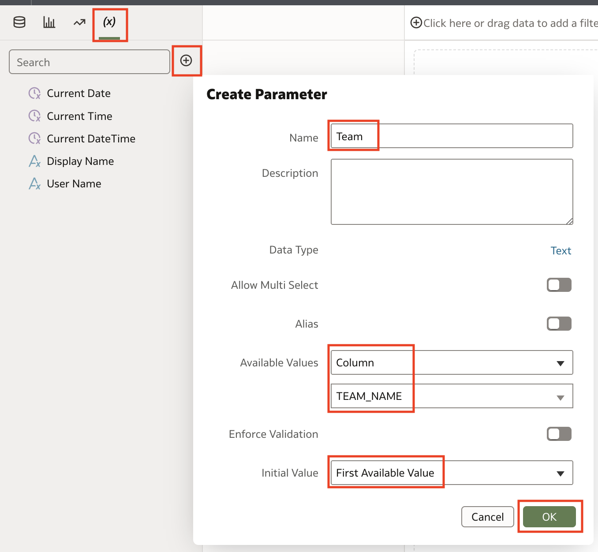
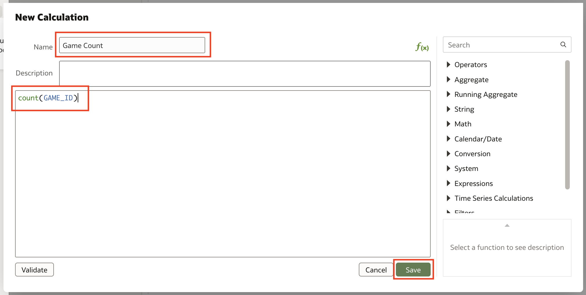
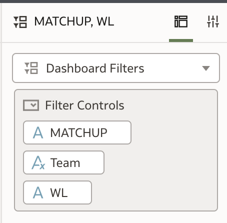
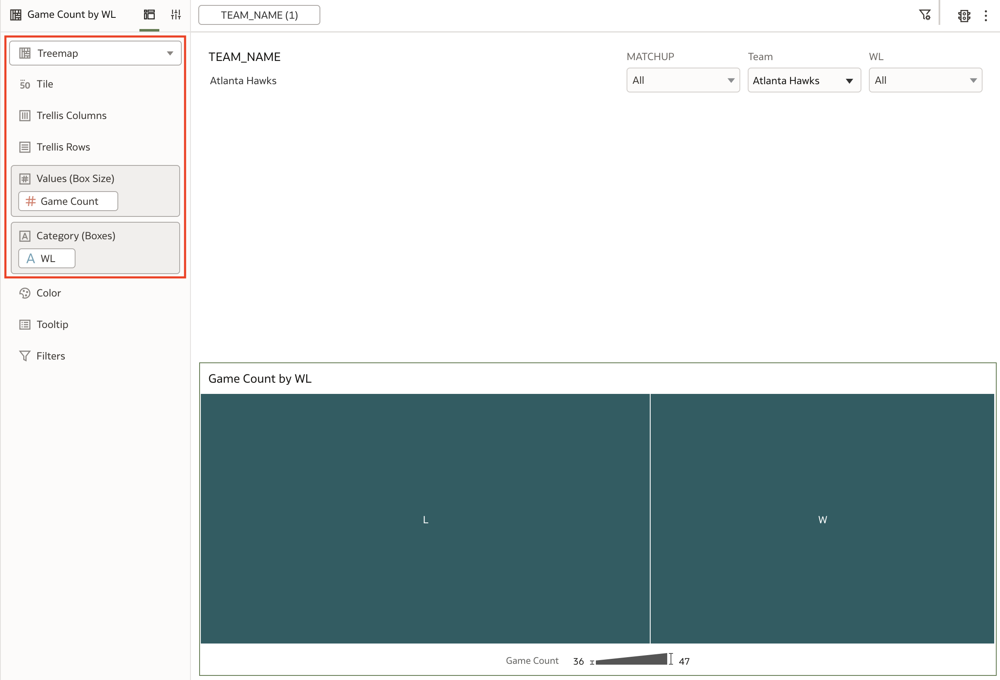
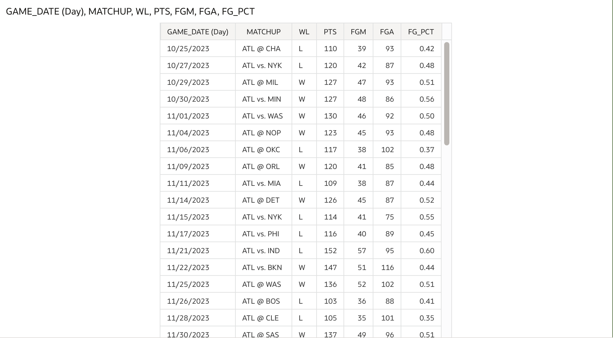
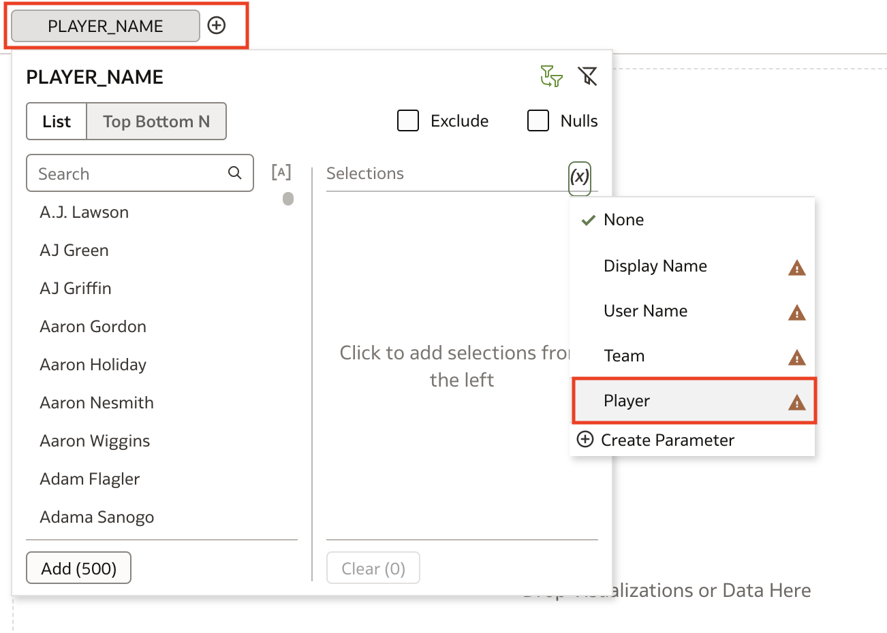
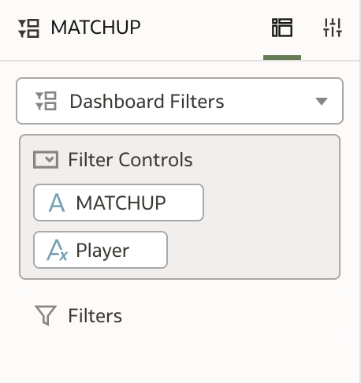
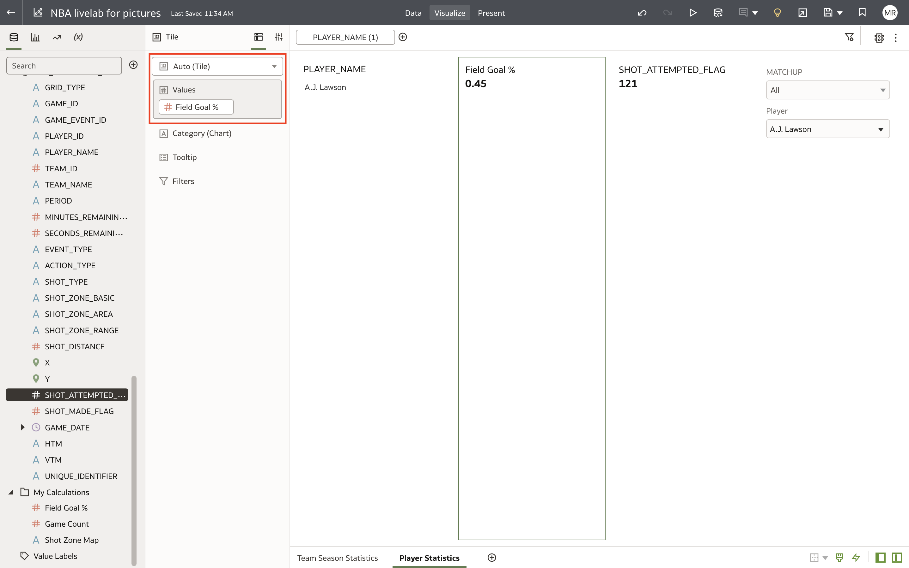

# Visualize Data in Oracle Analytics Cloud (OAC)

## Introduction
This lab walks you through the steps of creating self-service data visualizations in Oracle Analytics Cloud.

Estimated time - 20 minutes

### Objectives
In this lab, you will learn how to:
* Upload custom map layers using the Oracle Analytics Cloud Console
* Get familiar with parameters and filter binding
* Get familiar creating custom calculations

### Prerequisites
* A provisioned Oracle Analytics Cloud Instance
* BIServiceAdministrator Role assigned

## Task 1: Provision an Oracle Analytics Cloud Instance

1. Log into your OCI tenancy
2. In the region dropdown, select the correct region you'd like to provision your instance in
   
4. In the OCI console, open up the navigation menu and navigate to 'Analytics & AI' then 'Analytics Cloud'
   
6. Using the dropdown, select the compartment you want to provision OAC in
7. Use the 'Create Instance' to open the create analytics instance form
8. In the form, input the following for the required fields:
   - Name: NBAOACLivelab
   - Compartment: Make sure this compartment matches your desired compartment for the instance
   - Capacity Type: OCPU
   - Capacity OCPU Count: 2
   - License: License Included
   - Edition: Enterprise Edition
   
9. Press 'Create.' It may take approximately 20 minutes for your instance to be provisioned.

## Task 2: Import Custom Maps in OAC

1. CLICK HERE to download a zip file with the map layers and map backgrounds we will use in this task
2. From the OAC homepage, navigate to the console.
   
4. From the console, open 'Maps' under 'Visualizations and Sharing'
   
6. In the Maps page, navigate to the 'Backgrounds' tab and expand 'Image Backgrounds'
   
8. Add your images for NBA shot zones and NBA half court
   
10. Navigate to the 'Map Layers' tab and expand 'Custom Map Layers'
    
12. Upload your custom map layer 'NBA Shot Zones'
    

## Task 3: Create a Data Connection in OAC
1. From the OAC homepage, click on the 'Create' button in the top right corner and select 'Connection'
2. Select 'Oracle Autonomous Data Warehouse' from the available connectors
3. In the window, insert details for the required field and import your wallet
4. With all required fields populated press 'Save' to create your connection

## Task 4: Create a Data Set in OAC

## Task 5: Use Self Service DV to Create a Workbook
We will now develop a workbook with 3 canvases that will be used throughout the lab. 

1. From the OAC homepage, click on the 'Create' button in the top right corner and select 'Workbook.'
   
3. Add the dataset(s) you created in Task 3
4. Next we'll create two parameters. Create a 'Team' parameter in the parameter tab with the following settings:
  - Name: Team
  - Data Type: Text
  - Available Values: Column - TEAM_NAME
  - Initial Value: First Available Value
    
4. Create a 'Player' parameter in the parameter tab with the following settings:
  - Name: Player
  - Data Type: Text
  - Available Values: Column - PLAYER_NAME
  - Initial Value: First Available Value
    
5. Next we'll create a set of calculations we'll use. Create a calculation for 'Field Goal %'. In the calculation field input 'SHOT_MADE_FLAG/SHOT_ATTEMPTED_FLAG'
   
6. Next create a calculation to count the amount of games titled 'Game Count.' In the calculation field input 'count(GAME_ID).'
   
7. Lastly, create a calculation titled 'Shot Zone Map.' In the calculation field input 'CONCAT(CONCAT(SHOT_ZONE_BASIC, ' '), SHOT_ZONE_AREA)'
   
8. Rename the canvas 'Team Season Statistics' the first canvas we will make allows users to select a team and see their stats.
   
9. Add TEAM_NAME to the filter bar and bind the 'Team' parameter you created. This will filter the entire canvas to show team data.
   
10. Right-click TEAM_NAME in the data column and select 'Pick Visualization' then 'List.' This will display the team name to users.
    
11. Right-click MATCHUP in the data column and select 'Pick Visualization' then 'Dashboard Filters'
    
12. Add your Team parameter and the WL column to the dashboard filters by dragging and dropping it into the filter controls section.
    
13. Now add a treemap with your 'Game Count' calculation and 'WL' column.
    
14. Now add a table with GAME_DATE(day), MATCHUP, WL, PTS, FGM, FGA, FG_PCT, and any additional statistics you would like.
    
15. You can now move on to another canvas, title this one 'Player Statistics.'
    
16.  Add PLAYER_NAME to the filter bar and bind the 'Player' parameter you created. This will filter the entire canvas to show team data.
    
17. Right-click PLAYER_NAME in the data column and select 'Pick Visualization' then 'List.' This will display the player name to users.
    
18. Right-click MATCHUP in the data column and select 'Pick Visualization' then 'Dashboard Filters.' Then add your Player parameter to the dashboard filters by dragging and dropping it into the filter controls section.
    
19. Add separate tiles for Field Goal % and SHOT_ATTEMPTED_FLAG by dragging and dropping them onto the canvas.
    
20. Now drag Shot Zone Map and field Goal % onto the canvas and pick the map visualization. Check the properties panel to make sure the correct map background is selected in the 'Map' tab and correct map layer is selected in the 'Data Layers Tab.'
    
21. Next drag Shot Zone Map and SHOT_ATTEMPTED_FLAG onto the canvas and pick the map visualization. Check the properties panel to make sure the correct map background is selected in the 'Map' tab and correct map layer is selected in the 'Data Layers Tab.'
    
22. Lastly, for this canvas we will create a pivot table. Bring PERIOD, GAME_DATE (Day), HTM, VTM, and Field Goal % onto the canvas, make sure PERIOD is put into the columns category for the visualization.
    

You may now **proceed to the next lab**.

## Acknowledgements

* **Authors:**
   * 
