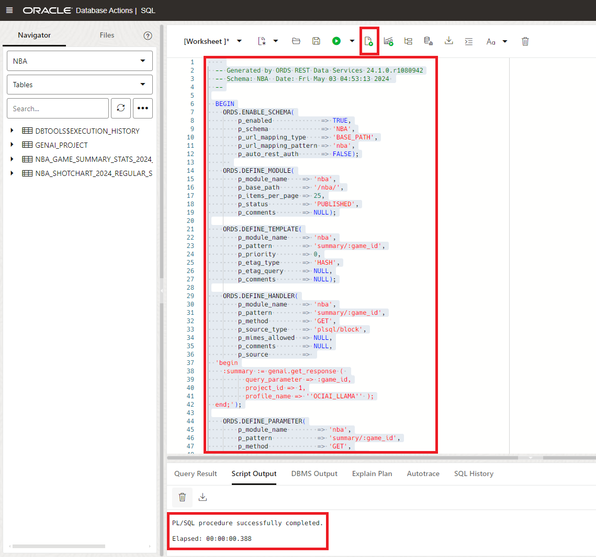

# Connect your data from the database to your app

## Introduction

If you want more control over how your APIs are organized and structured, you can design your APIs using Autonomous Database's REST design tool. Start by creating an API module. See the [Getting Started with RESTful Services](https://docs.oracle.com/en/database/oracle/oracle-rest-data-services/23.4/orddg/developing-REST-applications.html#GUID-25DBE336-30F6-4265-A422-A27413A1C187) documentation for additional information.

In this lab, we will create Restful API modules to connect to the data and Generative AI backends.

Estimated time - 20 minutes


### Objectives

* Create the Restful Modules
* Connect the Endpoints

## Task 1: Create the Restful Modules

1. Navigate to the Autonomous Database previously created in lab and click **Database Actions** to select **SQL**.

  

2. Ensure that your data is loaded in the menu.

3. Enable the use of the resource principal by the Admin user. Copy and paste the following code into your SQL Worksheet, and then click the **Run Script** icon.

    ```
    <copy>
    begin
      dbms_cloud_admin.enable_resource_principal(username  => 'Admin');
    end;
    /
    </copy>
    ```

  

4. Create an AI profile for the **Meta Llama 2 Chat model**. Copy and paste the following code into your SQL Worksheet, and then click the **Run Script** icon.

    ```
    <copy>
    BEGIN
    -- drops the profile if it already exists
        DBMS_CLOUD_AI.drop_profile(
            profile_name => 'OCIAI_LLAMA',
            force => true
        );     
        -- create a new profile that uses a specific model
        DBMS_CLOUD_AI.create_profile(
            profile_name => 'OCIAI_LLAMA',
            attributes => '{"provider":"oci",
                "model": "meta.llama-2-70b-chat",
                "credential_name":"OCI$RESOURCE_PRINCIPAL",
                "oci_runtimetype":"LLAMA"
            }');
    END;
    /
    </copy>
    ```
    

5. Create the GENAI_PROJECT table and a row insert by copying and pasting the following SQL statement in the SQL Worksheet, and then click the **Run Script** icon.

	```
	<copy>
	CREATE TABLE "ADMIN"."GENAI_PROJECT" 
	(	"ID" NUMBER, 
		"NAME" VARCHAR2(4000), 
		"QUERY" CLOB, 
		"TASK" VARCHAR2(4000), 
		"TASK_RULES" VARCHAR2(4000)
	);

	INSERT INTO ADMIN.GENAI_PROJECT (ID, NAME, QUERY, TASK, TASK_RULES)
	VALUES (1, 'RECENT', 'SELECT * FROM ADMIN.NBA_GAME_SUMMARY WHERE GAME_ID = :game_id', 'Summarize the basketball game and follow the task rules.', '1. Summarize the data. 2. Provide insight into game statistics. 3. Use the perspective of an NBA fan');
	</copy>
	```

    

6.  Copy and paste the following to enable the modules for both **`question\`** and **`summary\:game_id`**. Click the **run button** to run the PL/SQL.

  ```
  <copy>
    
  -- Generated by ORDS REST Data Services 24.1.0.r1080942
  -- Schema: ADMIN  Date: Fri May 03 04:53:13 2024 
  --

  BEGIN
    ORDS.ENABLE_SCHEMA(
        p_enabled             => TRUE,
        p_schema              => 'ADMIN',
        p_url_mapping_type    => 'BASE_PATH',
        p_url_mapping_pattern => 'admin',
        p_auto_rest_auth      => FALSE);
      
    ORDS.DEFINE_MODULE(
        p_module_name    => 'nba',
        p_base_path      => '/nba/',
        p_items_per_page => 25,
        p_status         => 'PUBLISHED',
        p_comments       => NULL);

    ORDS.DEFINE_TEMPLATE(
        p_module_name    => 'nba',
        p_pattern        => 'summary/:game_id',
        p_priority       => 0,
        p_etag_type      => 'HASH',
        p_etag_query     => NULL,
        p_comments       => NULL);

    ORDS.DEFINE_HANDLER(
        p_module_name    => 'nba',
        p_pattern        => 'summary/:game_id',
        p_method         => 'GET',
        p_source_type    => 'plsql/block',
        p_mimes_allowed  => NULL,
        p_comments       => NULL,
        p_source         => 
  'begin
    :summary := genai.get_response ( 
          query_parameter => :game_id,
          project_id => 1,
          profile_name => ''OCIAI_LLAMA'' );
  end;');

    ORDS.DEFINE_PARAMETER(
        p_module_name        => 'nba',
        p_pattern            => 'summary/:game_id',
        p_method             => 'GET',
        p_name               => 'game_id',
        p_bind_variable_name => 'game_id',
        p_source_type        => 'URI',
        p_param_type         => 'STRING',
        p_access_method      => 'IN',
        p_comments           => NULL);

    ORDS.DEFINE_PARAMETER(
        p_module_name        => 'nba',
        p_pattern            => 'summary/:game_id',
        p_method             => 'GET',
        p_name               => 'summary',
        p_bind_variable_name => 'summary',
        p_source_type        => 'RESPONSE',
        p_param_type         => 'STRING',
        p_access_method      => 'OUT',
        p_comments           => NULL);

    ORDS.DEFINE_TEMPLATE(
        p_module_name    => 'nba',
        p_pattern        => 'question/',
        p_priority       => 0,
        p_etag_type      => 'HASH',
        p_etag_query     => NULL,
        p_comments       => NULL);

    ORDS.DEFINE_HANDLER(
        p_module_name    => 'nba',
        p_pattern        => 'question/',
        p_method         => 'POST',
        p_source_type    => 'plsql/block',
        p_items_per_page => 25,
        p_mimes_allowed  => NULL,
        p_comments       => NULL,
        p_source         => 
  'declare
      l_response clob;
      l_sql clob;
      l_prompt varchar2(4000);
      l_cursor NUMBER := dbms_sql.open_cursor;
      l_profile_name user_cloud_ai_profiles.profile_name%type := genai_profile;
  begin

      if :P1_ASK_ADB = ''Y'' then
          -- question about customer data
          
          l_sql := dbms_cloud_ai.generate(
              prompt => :question,
              action => ''showsql'',
              profile_name => l_profile_name
              );
          
          -- check if SQL could be generated.
          -- if not, then return the response 
          BEGIN
              DBMS_SQL.PARSE (l_cursor, l_sql, DBMS_SQL.native);
          EXCEPTION
              WHEN OTHERS THEN
                  l_response := l_sql;
          END;
            
      else
          -- general chat
          l_response := dbms_cloud_ai.generate(
              prompt => :question,
              action => ''chat'',
              profile_name => l_profile_name
              );
        
      end if;
      
      l_p' || 'rompt := dbms_cloud_ai.generate(
          prompt => ''Rewrite as a short title : ''||:question,
          action => ''chat'',
          profile_name => l_profile_name
      );

  end;');

    ORDS.DEFINE_PARAMETER(
        p_module_name        => 'nba',
        p_pattern            => 'question/',
        p_method             => 'POST',
        p_name               => 'question',
        p_bind_variable_name => 'question',
        p_source_type        => 'HEADER',
        p_param_type         => 'STRING',
        p_access_method      => 'IN',
        p_comments           => NULL);

    ORDS.DEFINE_PARAMETER(
        p_module_name        => 'nba',
        p_pattern            => 'question/',
        p_method             => 'POST',
        p_name               => 'ASK_ADB',
        p_bind_variable_name => 'ASK_ADB',
        p_source_type        => 'HEADER',
        p_param_type         => 'STRING',
        p_access_method      => 'IN',
        p_comments           => NULL);

      
          
  COMMIT;

  END;
  </copy>
  ```

  

7. Navigate to the REST modules by clicking the **side-menu button** and click **REST**.

  

8. Click **MODULES** to navigate to the newly created module.

  

9. Click **nba** to navigate to the endpoints.

  

## Task 2: Connect the Endpoints

1. Navigate back to the Visual Builder App and 


You may now **proceed to the next lab**.

## Learn More


## Acknowledgements

* **Authors:**
	* Nicholas Cusato - Cloud Engineer
	* Malia German - Cloud Engineer
	* Miles Novotny - Cloud Engineer
* **Last Updated by/Date** - Nicholas Cusato, May 2024