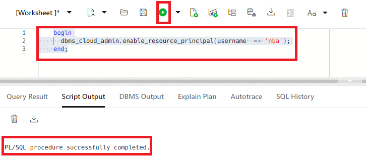

# Connect your data from the database to your app

## Introduction

If you want more control over how your APIs are organized and structured, you can design your APIs using Autonomous Database's REST design tool. Start by creating an API module. See the [Getting Started with RESTful Services](https://docs.oracle.com/en/database/oracle/oracle-rest-data-services/23.4/orddg/developing-REST-applications.html#GUID-25DBE336-30F6-4265-A422-A27413A1C187) documentation for additional information.

In this lab, we will create Restful API modules to connect to the data and Generative AI backends.

Estimated time - 20 minutes


### Objectives

* Create the Restful Modules
* Connect the Endpoints

## Task 1: Create the Restful Modules

1. Navigate to the Autonomous Database previously created in lab and click **Database Actions** to select **SQL**.

  

2. Ensure that your data is loaded in the menu.

3. Enable the use of the resource principal by the Admin user. Copy and paste the following code into your SQL Worksheet, and then click the **Run Script** icon.

    ```
    <copy>
    begin
      dbms_cloud_admin.enable_resource_principal(username  => 'Admin');
    end;
    /
    </copy>
    ```

  

4. Create an AI profile for the **Meta Llama 2 Chat model**. Copy and paste the following code into your SQL Worksheet, and then click the **Run Script** icon.

    ```
    <copy>
    BEGIN
    -- drops the profile if it already exists
        DBMS_CLOUD_AI.drop_profile(
            profile_name => 'OCIAI_LLAMA',
            force => true
        );     
        -- create a new profile that uses a specific model
        DBMS_CLOUD_AI.create_profile(
            profile_name => 'OCIAI_LLAMA',
            attributes => '{"provider":"oci",
                "model": "meta.llama-2-70b-chat",
                "credential_name":"OCI$RESOURCE_PRINCIPAL",
                "oci_runtimetype":"LLAMA"
            }');
    END;
    /
    </copy>
    ```
    

5. Create the GENAI_PROJECT table and a row insert by copying and pasting the following SQL statement in the SQL Worksheet, and then click the **Run Script** icon.

	```
	<copy>
	CREATE TABLE "ADMIN"."GENAI_PROJECT" 
	(	"ID" NUMBER, 
		"NAME" VARCHAR2(4000), 
		"QUERY" CLOB, 
		"TASK" VARCHAR2(4000), 
		"TASK_RULES" VARCHAR2(4000)
	);

	INSERT INTO ADMIN.GENAI_PROJECT (ID, NAME, QUERY, TASK, TASK_RULES)
	VALUES (1, 'RECENT', 'SELECT * FROM ADMIN.NBA_GAME_SUMMARY WHERE GAME_ID = :game_id', 'Summarize the basketball game and follow the task rules.', '1. Summarize the data. 2. Provide insight into game statistics. 3. Use the perspective of an NBA fan');
	</copy>
	```

6.  Click the **Selector** (hamburger) in the banner, and then click **REST**.
  

1. View the list of modules. In the REST tool, click the **Modules** tab.
  

  A module named **api** was created by the Terraform script.
  
  

3. Let's create a new module that the **MovieStreamAI** app will use. Click **Create Module**.

4. Specify the following for the new module. Make sure all the fields match the image below. Next, click **Create**.

    * **Name:** `apiapp`
    * **Base Path:** `/apiapp/`
    * **Protected By Privilege:** `Not Protected`
  
      
 
5. The newly created **apiapp** module is displayed. From here, we will create multiple templates that will provide RESTful services. The endpoints will be designated by either data collection (named **data/**) or AI generated responses (named **ai/**).

6. First, let's create the data collection api for the **recently watched movies**. Click **Create Template**. The **Create Template** panel is displayed.

  

7. In the **URI Template** field, enter **`data/image/:cust_id`** as the name for the template. Next, then click **Create**.

    >**Note:** Use the exact name, **`data/image/:cust_id`**. Our React app is expecting that name.

    

8. Click **Create Handler** to implement the API.

  

## Task 2: Connect the Endpoints

1.


You may now **proceed to the next lab**.

## Learn More


## Acknowledgements

* **Authors:**
	* Nicholas Cusato - Cloud Engineer
	* Malia German - Cloud Engineer
	* Miles Novotny - Cloud Engineer
* **Last Updated by/Date** - Nicholas Cusato, May 2024