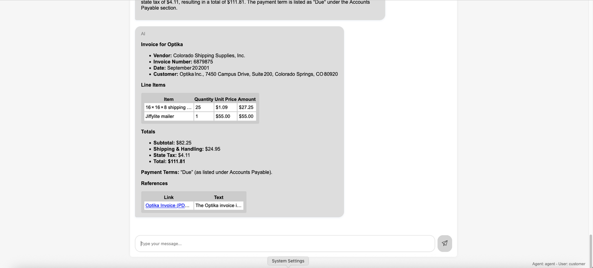

# Test with LangGraph

## Introduction
In this lab, we will test the installation using LangGraph
Estimated time: 10 min

### Objectives

- Test the program using a LangGraph user interface.

### Prerequisites
- The lab 1 must have been completed.

## Task 1: Test 

1. Check the URL at the end of the terraform run
    
1. Go to the url of the application (ex: https://xxxx.apigateway.eu-frankfurt-1.oci.customer-oci.com/xxxx/chat.html)
   
1. Type "what is Oracle Analytics Cloud", then *Enter*

    Hover on the citation. Note that you can see the page number. Click on the link.
        

1. Type "List the countries in the map of brazil", then *Enter*

1. Try more questions:

    | File type | Extension | Question                                          |
    | ----------| --------- | ------------------------------------------------- |
    | PDF       | .pdf      | When was jazz created ?                           |
    |           |           | What is Document Understanding                    |
    | Word      | .docx     | What is OCI ?                                     |
    | Image     | .png      | List the countries in the map of brazil           |
    | Website   | .sitemap  | What is Digital Assistant ?                       |
    | Website   | .crawler  | What can I see in France ?                        |
    | FAX       | .tif      | Is there an invoice for Optika ?                  | 
    |           |           | What does the file invoice.tif contains ?         |
    | Video     | .mp4      | What is Oracle Analytics                          | 
    | Audio     | .mp3      | What is the issue with my headphones ?            | 

**You may now proceed to the [next lab.](#next)**

## Known issues

None

## Acknowledgements

- **Author**
    - Marc Gueury, Generative AI Specialist
    - Anshuman Panda, Generative AI Specialist
    - Maurits Dijkens, Generative AI Specialist

