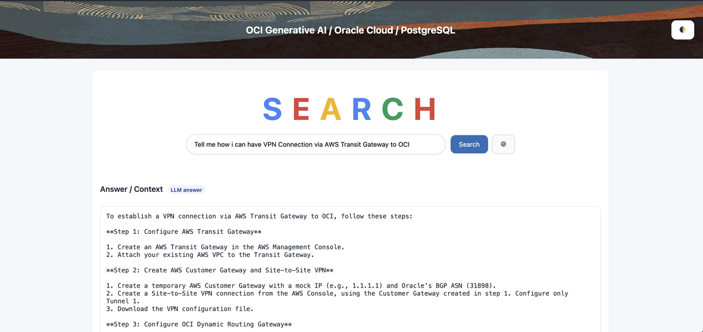
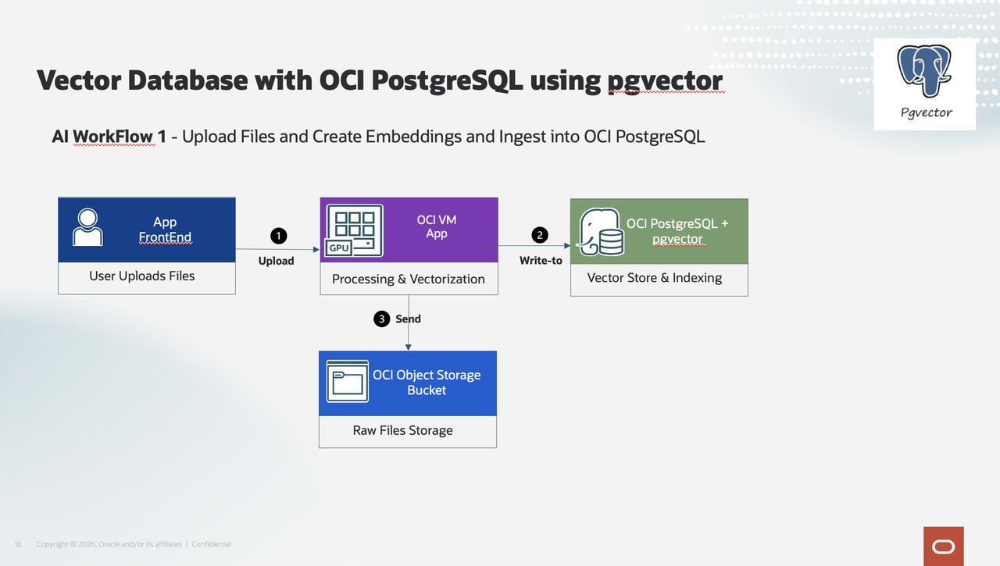
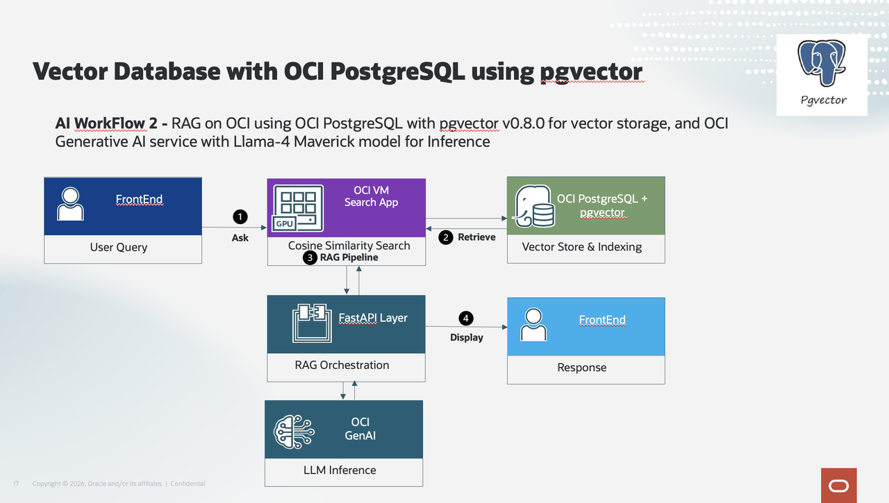

# Introduction

## About This Workshop
We will create a Generative AI / Hybrid Search web application, using Terraform. This application will search documents using OCI Database with PostgreSQL and the pgvector extension. pgvector will turn our OCI Database with PostgreSQL into a vector database where we can natively store and manage vector embeddings while handling unstructured data like pdf documents and html files.

We’ll be able to search documents like:
- PDF with text 
- HTML files
- Text Files
- CSV files
- XML files

The website created during the workshop has several ways to search:
- Full Text Search: Based on *Words* in the documents
- Semantic Search: Based on the *Meaning* (Vector Search)
- Hybrid: Based on the 2 above search
- RAG (Retrieval Augmented Generation): Answer questions based on documents

The procedures in this workshop are designed for users that have obtained an Oracle Cloud free trial account with active credits. The procedures will also work for other Oracle Cloud accounts but may, in some cases, require minor adaptation.

Estimated Workshop Time: 90 minutes

### Architecture

It works like this:
1. A document is uploaded in the Search App
2. The document is converted, parsed & cleaned.
3. Using an embedding model, vector embeddings are created and stored in OCI PostgreSQL database
4. You can now ask natural language questions in the App to retrieve results using a combination of semantic search using pgvector and OCI Generative AI service LLM

This picture shows the ingestion, embeddings and RAG pipeline workflow.

### Objectives

- Provision the services needed for the system
    - Compartment, VCN, Compute Intance, PostgreSQL, and Genarative AI services.

## Prerequisites
### Cloud Account
You need an Oracle Cloud account (i.e. access to an OCI tenancy) to complete this workshop. Participants can take advantage of Oracle's free trial account that comes with free cloud credits that are good for 30 days or until used up. Many Oracle events, such as CloudWorld, offer trial accounts with extra free cloud credits. You should be able to complete this workshop in the allotted time if your free trial cloud account is already created and ready to use. If you previously had a free trial account but the credits have expired, you won't be able to complete the lab. An option in this case is to obtain a new free trial account with fresh credits using a different email address. You can also use an existing paid Oracle Cloud account as long as you have administrator rights that will be needed to provision services.

### Laptop
You need a computer (laptop or desktop) with web browser, a text editor, and internet access. (Attempting to accomplish this workshop using a tablet or phone might be possible but is not recommended and it hasn't been tested on those types of devices.)

### Access to Frankfurt or Chicago
- *The Cloud Account should have access to the Chicago Region or Frankfurt region* where the Generative AI is available.
    - For Free Trial account, this means that the Free Trial should be created in the Chicago region
    - For Paid account, you will need to add the Chicago or Frankfurt Region to your tenancy to access the Generative AI APIs. (See lab 1) 

**Please proceed to the [next lab.](#next)**

## Acknowledgements 

- **Created By/Date** - Shadab Mohammad, Master Principal Cloud Architect, January 2026
- **Last Updated By** - Shadab Mohammad, January 2026
