# Install the Components

## Introduction
In this lab, you will install all the components needed for this workshop. Some of these will be provisioned manually and many will be provisioned automatically using a provided Terraform script.

Estimated time: 40 min

### Objectives

- Provision all the cloud components

### Prerequisites

- An OCI Account with sufficient credits where you will perform the lab. (Some of the services used in this lab are not part of the *Always Free* program.)
- Choose which web browser to use before you start. There is an option in a later lab to download a github repo to your local computer using the OCI Console Cloud Shell. Some users have experienced a bug attempting to do this with the Firefox Browser Extended Support Release (ESR). The Chrome browser is an alternative in this case.
- Check that your tenancy has access to the **Chicago or Frankfurt Region**
    - For Paid Tenancy
        - Click on region on top of the screen
        - Check that the Chicago (or Frankfurt) Region is there (Green rectangle)
        - If not, Click on Manage Regions to add it to your regions list. You need Tenancy Admin right for this.
        - Click on the US MidWest (Chicago)
        - Click Subscribe

    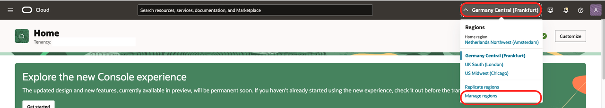

    - For Free Trial, the home region should be Chicago (or Frankfurt)
- The OCI User used in this LiveLab should have OCI Administrator Priviliges in the OCI Tenancy


## Task 1: Create a Compartment

The compartment will be used to contain all the components of the lab.

You can
- Use an existing compartment to run the lab 
- Or create a new one (recommended)

1. Login to your OCI account/tenancy

2. Go the 3-bar/hamburger menu of the console and select
    1. Identity & Security
    1. Compartments
    
    
2. Click ***Create Compartment***
    - Give a name: ***oci-starter***
    - Then again: ***Create Compartment***
    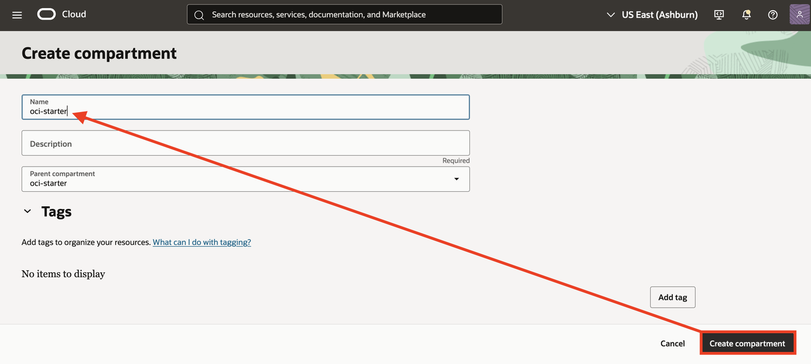

## Task 2: Create OCI API Key

The API key will be used to access OCI command line tool and OCI Generative AI service programatically 

1. Go to OCI Console Homepage

2. Click User icon on the top right and *User Settings*

    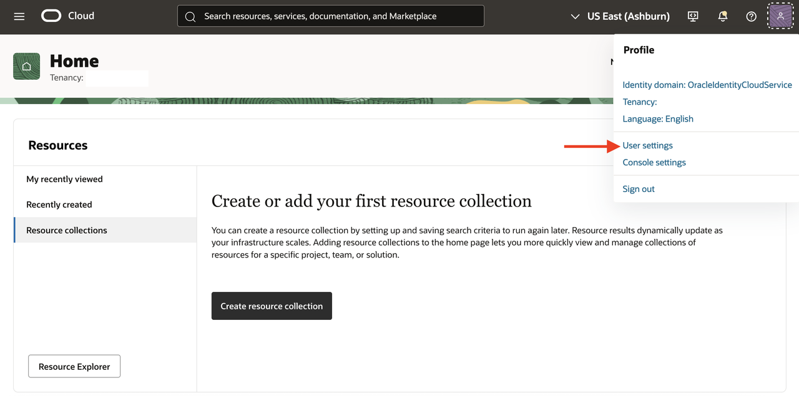
    
3. Go to *Tokens & Keys*, then *Add API Key*
    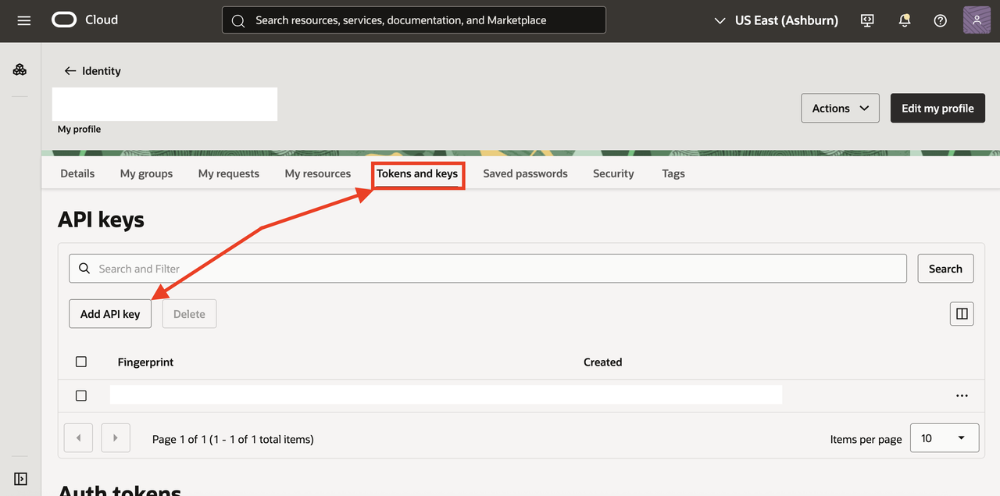
    
4. Generate API Key pair and Download the Private an Public Key. 
    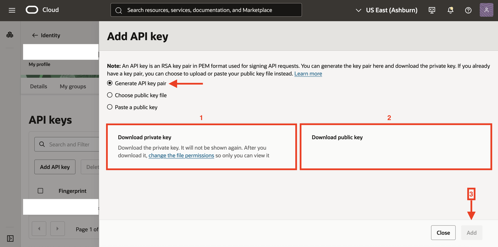
    
***We will use the public key later in provisioning the stack and private key to connect to the VM***


## Task 3: Run Terraform script 

1. Download the Github code to your Local machine

    ````
   git clone https://github.com/shadabshaukat/oracle-livelabs.git
     ````

       
3. Go to OCI Console Home Page

4. Click on *Developer Services* and then *Stack*
    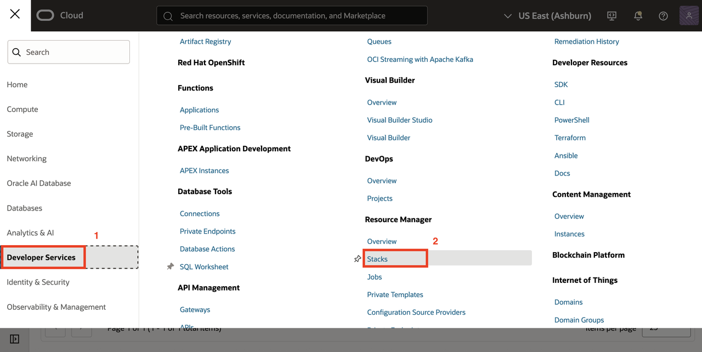

5. Change your compartment to the one created in Task 1 above

6. Select *My Configuration* scroll down to the *Stack Configuration* and add the newly downloaded folder
       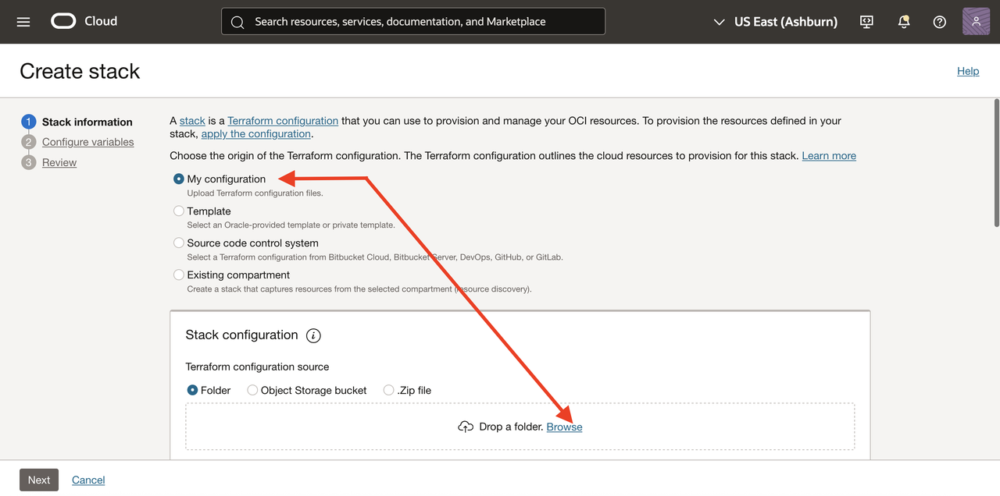
       
   Select the *oci_postgres_tf_stack* folder from your local machine
       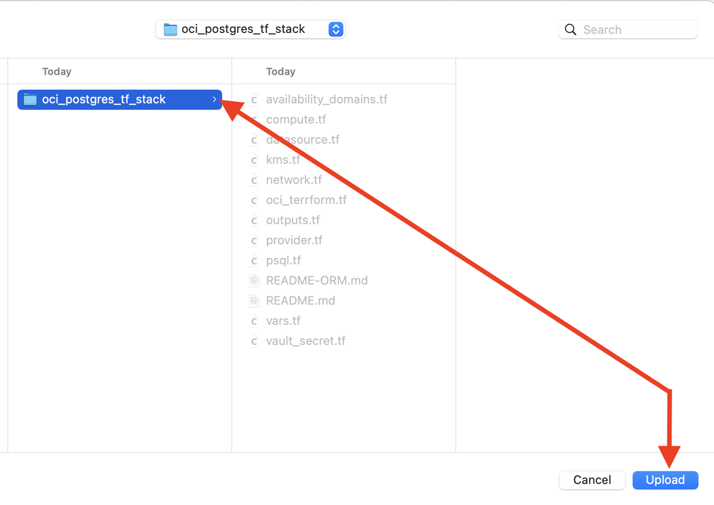
       
7. Select the compartment and click **Next**
       

8. Select the **compute assign public ip** option
          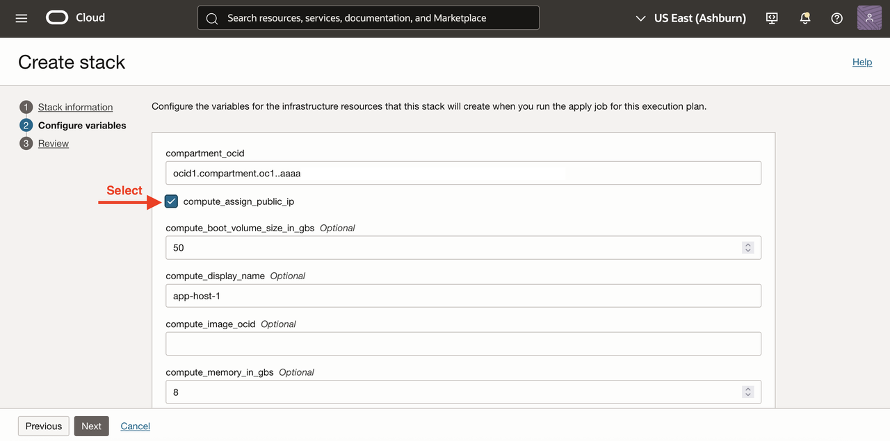

9. Paste the Public SSH key created in Task 2 and check **create compute** | **create_psql_configurtion** box
    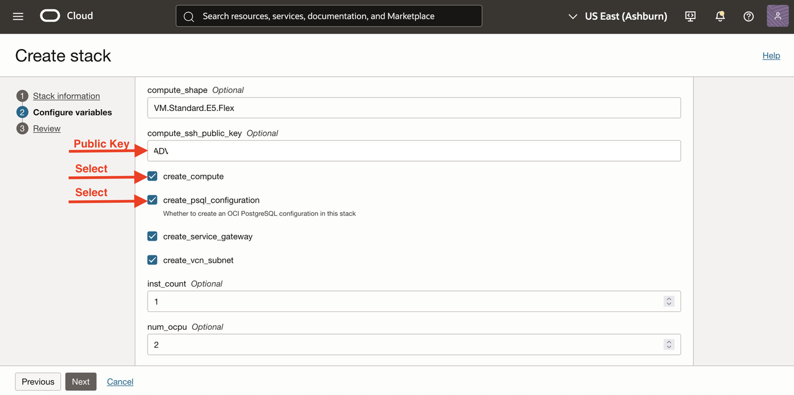

10. pgvector extension and user variables added
     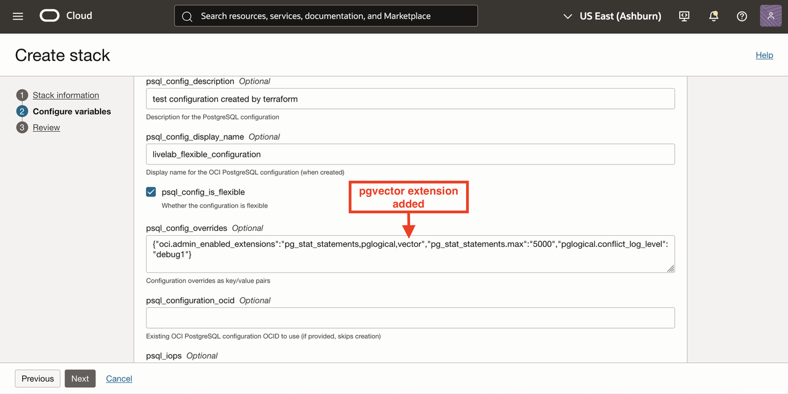

11. Enter Postgres Admin user and password
              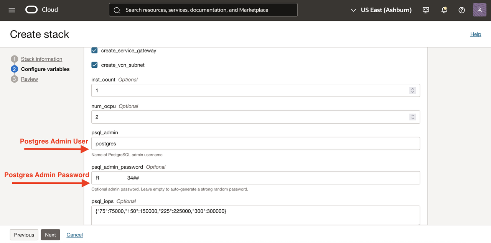

12. Enter a region and click next
              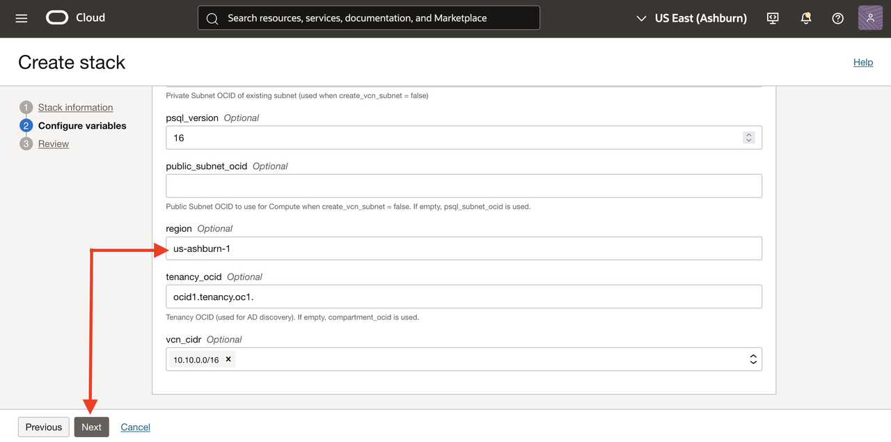

13. Select *Run apply* and create the stack
              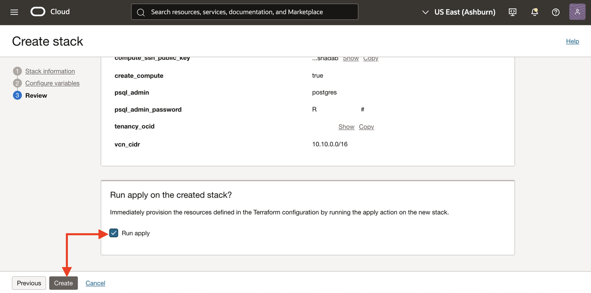

14. Wait about 10-15 minutes for the stack to finish provisioning
              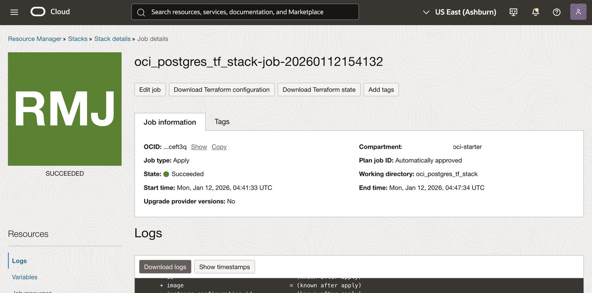
              

Copy the last 10 lines of the job log and save it in a notepad, it will be like something below

````
Outputs:
compute_instance_id = "ocid1.instance.oc1.iad.anuw...................uq"
compute_private_ip = "10.10.2.23"
compute_public_ip = "150.x.x.74"
compute_state = "RUNNING"
psql_admin_pwd = <sensitive>
psql_configuration_id = "ocid1.postgresqlconfiguration.oc1.iad.amaaaaa............snq" 
````


14. Go to OCI Console *Compute* and then *Instances*
              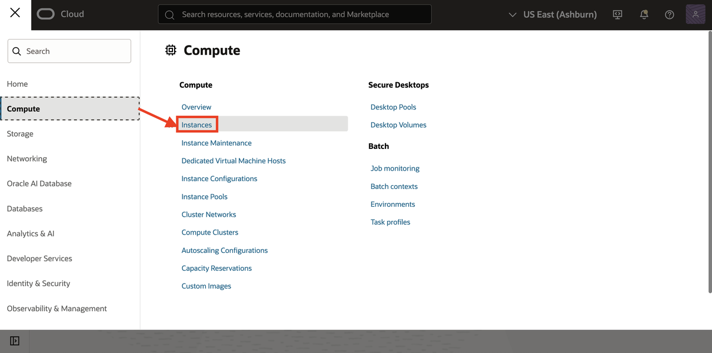

Copy the public IP of the instance 
              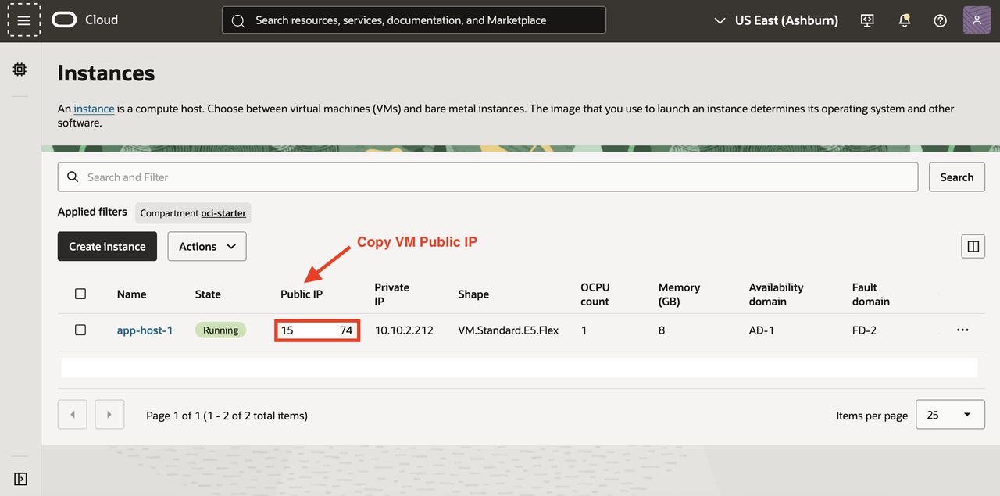


## Task 4: Setup Application

1. Go to your Terminal and Copy the public IP from Task 3 step 14 and use the Private Key from Task 2.

      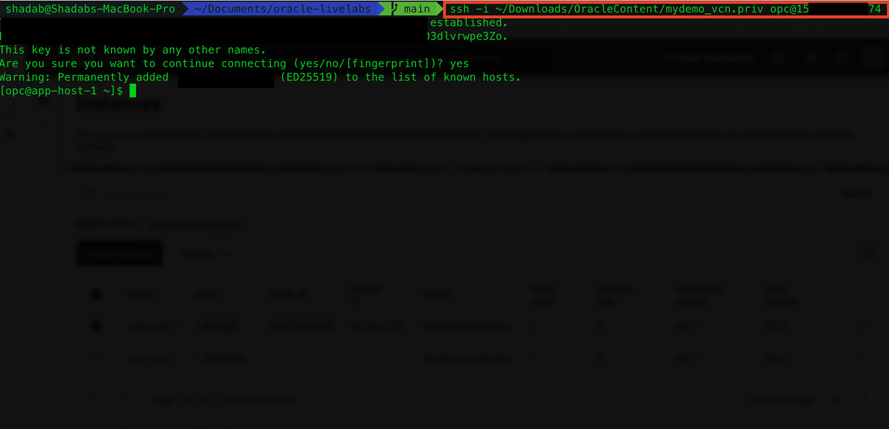

2. Install Linux Packages
   
````
sudo dnf install -y curl git unzip firewalld oraclelinux-developer-release-el10 python3-oci-cli postgresql16
````

3. Add firewall rules
   
````
# uv installer and PATH
curl -LsSf https://astral.sh/uv/install.sh | sh
export PATH="$HOME/.local/bin:$PATH"

# Firewalld rules for the app port (default 8000)
sudo systemctl enable --now firewalld
sudo firewall-cmd --permanent --add-port=8000/tcp
sudo firewall-cmd --reload
````

4. Download the Code Repository

````
git clone https://github.com/shadabshaukat/oracle-livelabs.git
````

5. Setup OCI ClI

Before we proceed upload the private key downloaded in Task 2 to this host and rename it to **priv.key** the location is /home/opc/priv.key

````
chmod 600 /home/opc/priv.key
````

````
oci setup config
````

Enter the details as per Task 2

````
Enter a location for your config [/home/opc/.oci/config]:
Enter a user OCID: ocid1.user.oc1..aaaaaa...........................aq
Enter a tenancy OCID: ocid1.tenancy.oc1..aaaaaaaa....................ua
Enter a region by index or name(e.g.) :  us-ashburn-1

Enter the location of your API Signing private key file: /home/opc/priv.key

Config written to /home/opc/.oci/config
    If you haven't already uploaded your API Signing public key through the
    console, follow the instructions on the page linked below in the section
    'How to upload the public key':

        https://docs.cloud.oracle.com/Content/API/Concepts/apisigningkey.htm#How2
````

6. Configure the variables to reflect the provisioned stack and API keys

````
cd oracle-livelabs/search-app/
````

````
vi .env.example
````

Add DB Parameters based on the DBSystem created earlier
````
DB_HOST=10.10.1.83
DB_PORT=5432
DB_NAME=postgres
DB_USER=postgres
DB_PASSWORD=YourPWD12345##
DB_SSLMODE=require
DB_POOL_MIN_SIZE=1
DB_POOL_MAX_SIZE=10
````

Add OCI cli parameters based on the API Key created earlier

````
# Set one of: none | openai | oci
LLM_PROVIDER=oci
OPENAI_API_KEY=
OPENAI_MODEL=

# OCI Generative AI (when LLM_PROVIDER=oci)
OCI_REGION=us-chicago-1
OCI_COMPARTMENT_OCID=ocid1.compartment.oc1..aaaaaaaad........................mfa
OCI_GENAI_ENDPOINT=https://inference.generativeai.us-chicago-1.oci.oraclecloud.com
OCI_GENAI_MODEL_ID=ocid1.generativeaimodel.oc1.us-chicago-1.amaaaaaask7d.......zta
#
# Option 1: Use config file
OCI_CONFIG_FILE=/home/opc/.oci/config
OCI_CONFIG_PROFILE=DEFAULT
# Option 2: API key envs
OCI_TENANCY_OCID=
OCI_USER_OCID=
OCI_FINGERPRINT=
OCI_PRIVATE_KEY_PATH=
OCI_PRIVATE_KEY_PASSPHRASE=
````

7. Copy environment variables in example file to .env file

````
cd /home/opc/oracle-livelabs/search-app

cp -p .env.example .env
````

8. Run the Stack

````
bash run.sh
````

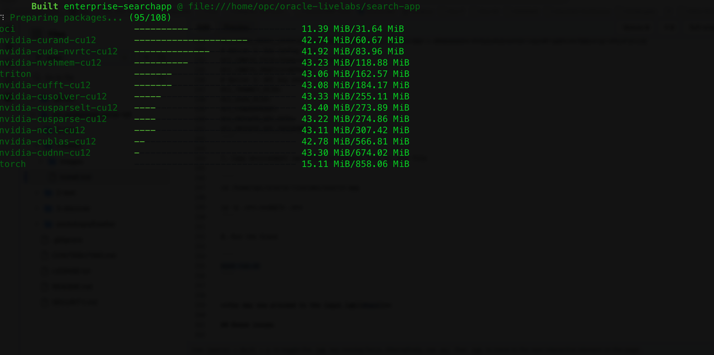
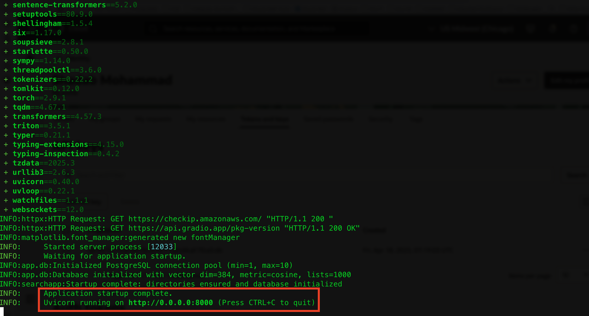

After the app has completed startup, open a browser with the public IP of the VM with tcp/8000

````
http://128.x.x.54:8000/
````

Enter the API Auth User and Password set in the **.env.example** file earlier

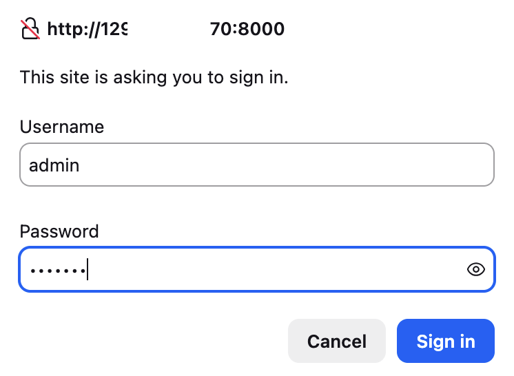


**You may now proceed to the [next lab](#next)**

## Known issues

None

## Acknowledgements

- **Created By/Date** - Shadab Mohammad, Master Principal Cloud Architect, January 2026
- **Last Updated By** - Shadab Mohammad, January 2026

