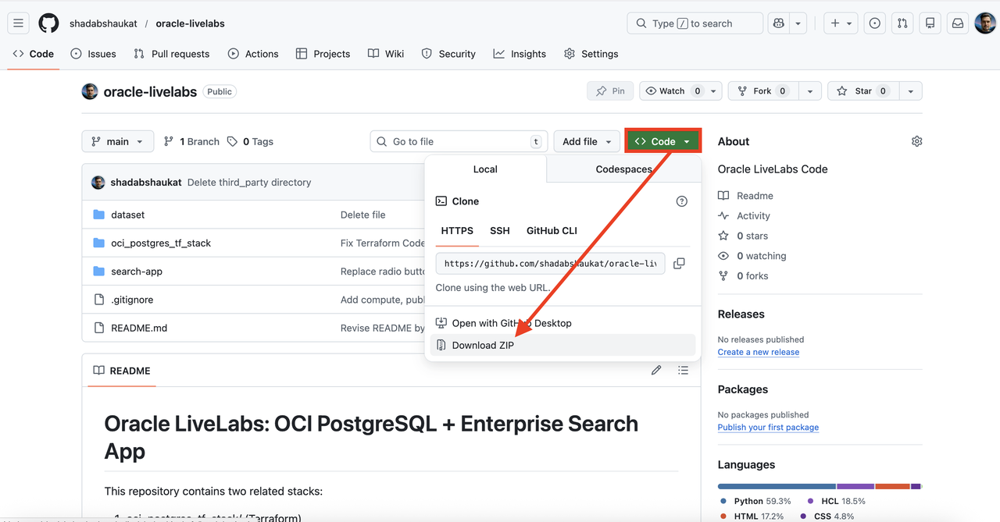
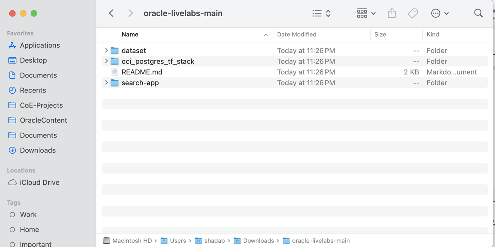
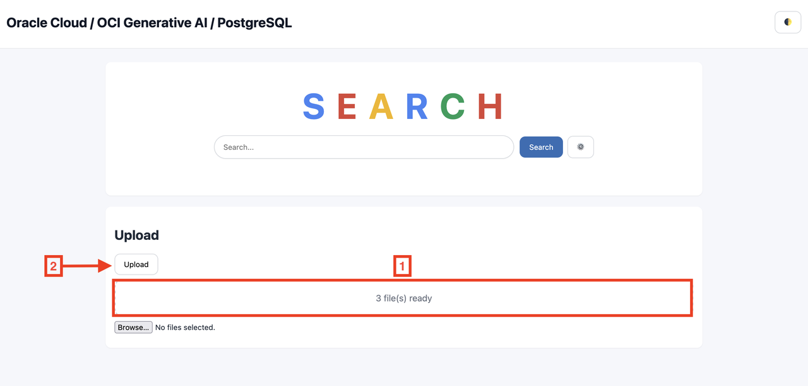
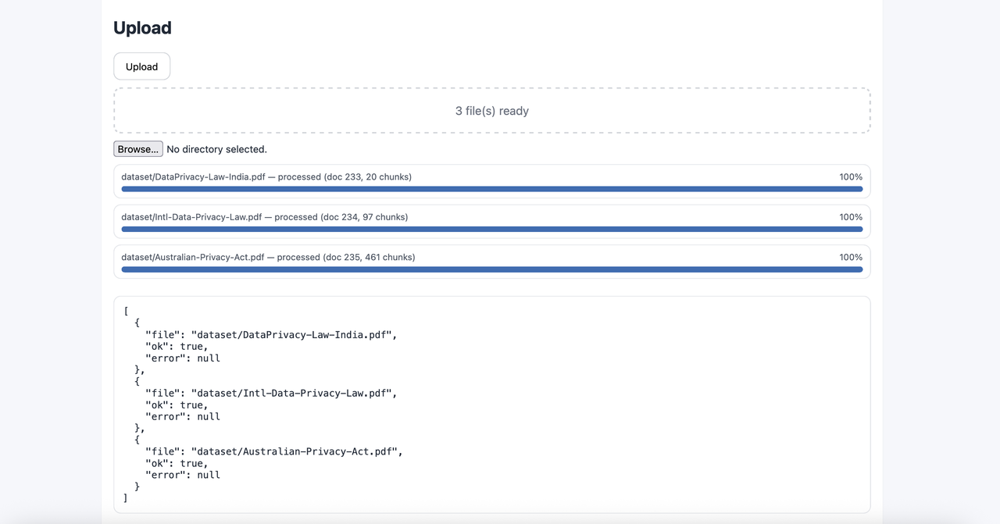
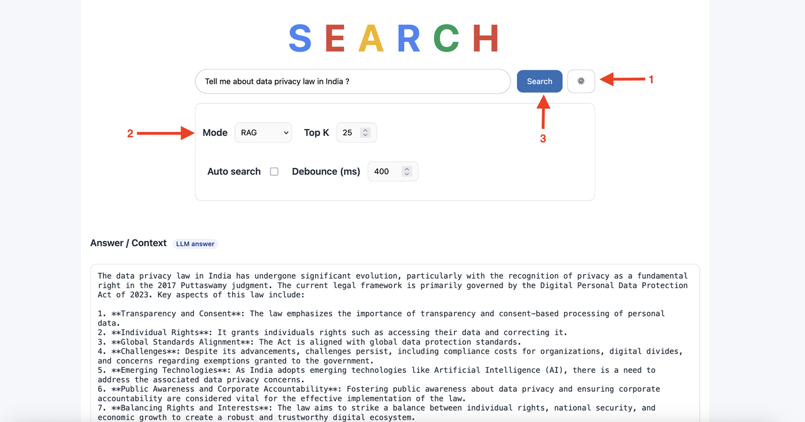
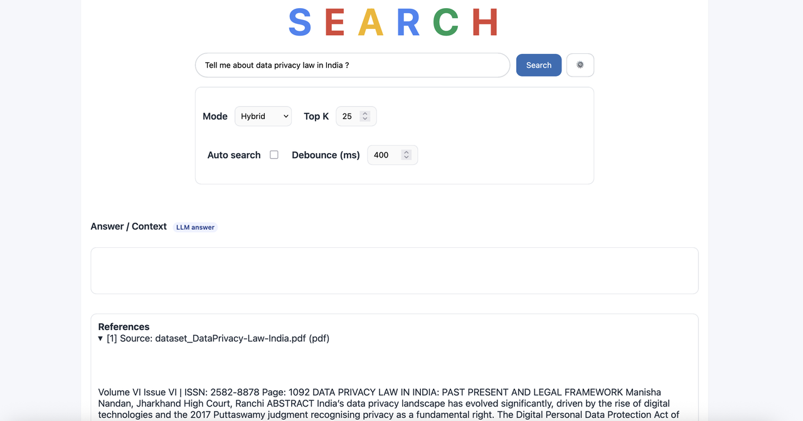
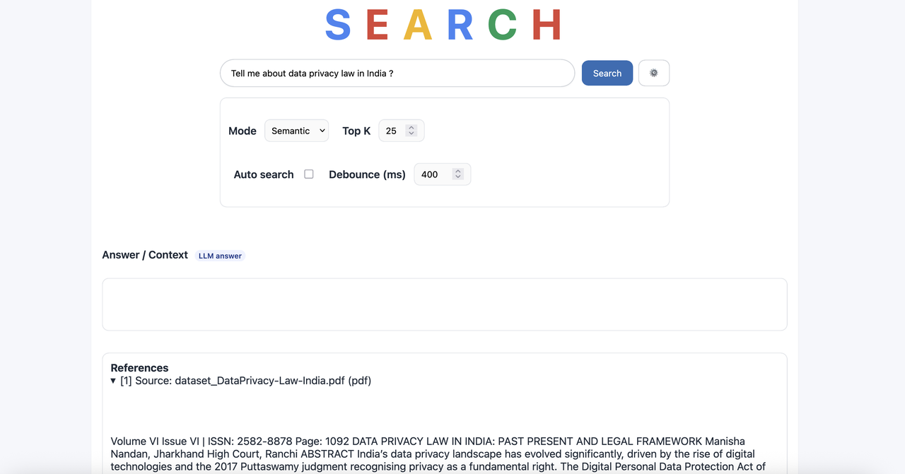
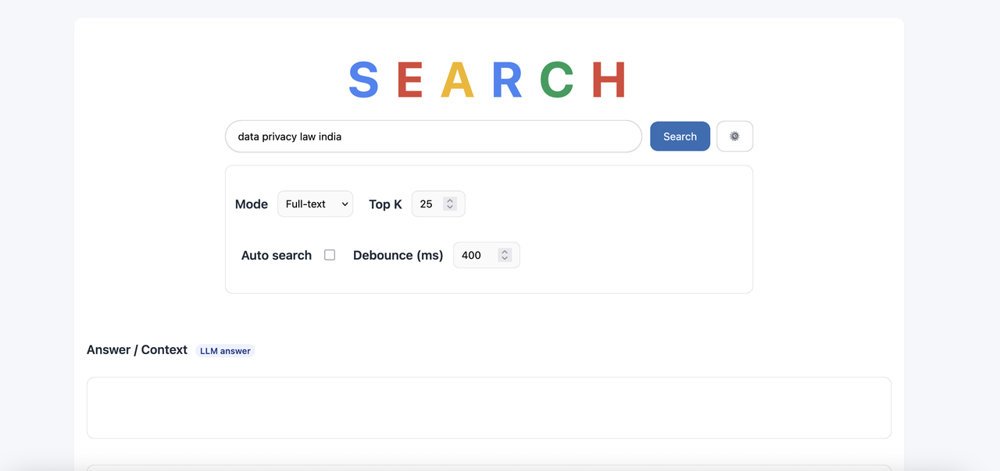

# Upload Files and Test the Search Application

## Introduction
In this lab, we will test what we created in Lab 1
Estimated time: 20 min

### Objectives

- Test the program

### Prerequisites
- The previous lab must have been completed.

## Task 1: Download RAG dataset
You will need samples files on your laptop/desktop. To download the files to your laptop from the Github website, please follow these steps.

1. In a new tab or window of your Internet browser, go to https://github.com/shadabshaukat/oracle-livelabs and click *Code* and then *Download ZIP*.

1. Extract the oracle-livelabs-main.zip file to your computer. 
 

1. Note the directory contains the program runned in previous lab in the ***search-app*** folder, and samples files in the ***dataset*** folder.

## Task 2: Upload the sample files to the search app

You will load a file into the search app which will be parsed, chunked, vector embeddings created & ingested into the OCI PostgreSQL database. 
     
1. Go to the ##APP URL## (eg:http://123.123.123.123:8000/)
    
    Drag the folder into the Upload Drop zone and then *Upload*

    
    

1. Type "Tell me about data privacy law in India ?", then *RAG Search*

        

1. Type "Tell me about data privacy law in India ?", then *Hybrid Search*

    
   
1. Type "Tell me about data privacy law in India ?", then *Semantic Search*

      

1. Now instead of doing semantic search or RAG, we will do keywords based search in the database. select *Full Text Search*
   
    - Type "Data Privacy Law in India", then *Search*

    
           
 
## Task 3: Optional - Test additional files
This is an optional test you can run with more sample files. If you do this test, you will have more content in the database. If you're running short of time, then you can skip it or come back to it later.

**You may now proceed to the [next lab.](#next)**

## Known issues

None

## Acknowledgements

- **Created By/Date** - Shadab Mohammad, Master Principal Cloud Architect, January 2026
- **Last Updated By** - Shadab Mohammad, January 2026

