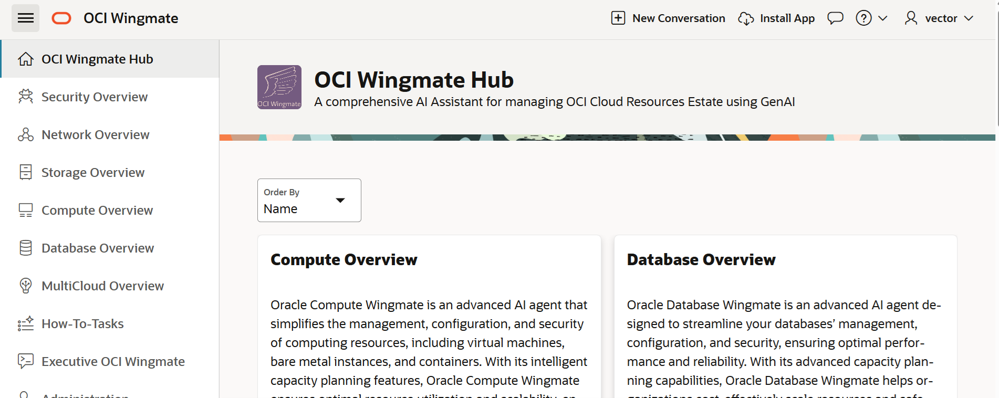
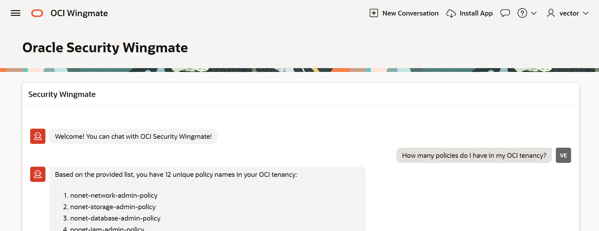
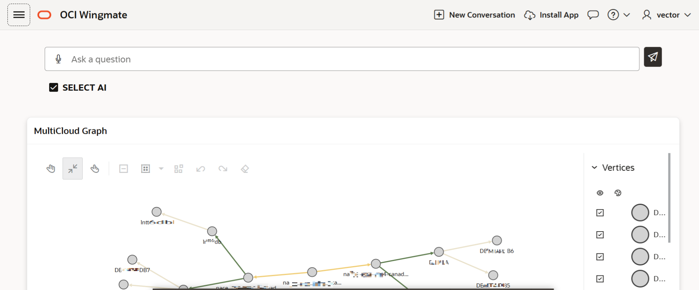
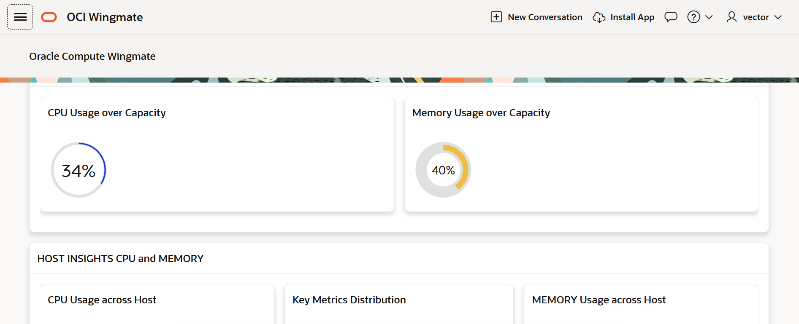

# Introduction

## About this Workshop
The scope of this workshop is to create a Oracle Cloud Infrastructure (OCI) Wingmate that will help monitor the security and deliver operations insights of a tenancy. This workshop uses Oracle 26ai Autonomous AI Database to store data collected from a tenancy and APEX to generate a dashboard to deliver operational insights never seen before. 

[**Resource Analytics**](https://www.oracle.com/manageability/resource-analytics/) is a new product on OCI that provides near real-time information to enahance the visibility across IT infrastructure. This lab will serve as a guide for new users looking to get started with Resource Analytics and start building using APEX.

The lab was deisgned to enable a user to develop an app from scratch using a combination of data sources: synthetic flat files, RESTful API, and/or Resource Analytics. 
* First, for convience, synthetic data was populated into flat files (CSVs) to simulate batch data gathered from an API or other methods. 
* Second, RESTful API direct connection is simulated by showing the users how to connect to tenancy resources, which may or may not be supported by other means (ie. Resource Analytics).
* Third, Resource Analytics simulates a near real-time direct connection to tenancy information to populate the app and begin asking complex Natural Language questions (using Wingmate) or visualizing scenarios using Property Graphs. 

**Note:** Wingmate isn't a product branded by Oracle, but simply a new way of creating a data model and unlocking new insights about your data using APEX, which may or may not be supported by Resource Analytics. The advantage of building on APEX is that it is Free, while it allows for a more customizable experience. This lab has optionality to build the app and **import into the "side-car" Autonomous AI Database that is provisioned by Resource Analytics**.

Utilitizing natural language, querying tenancy information makes operations oversight a breaze. 

Using all the features of a sophisticated data model on a converged database allows deeper insights into how resources are dependent on eachother. For example, PDBs in a multitenant architecture can be visualized with Graph to better understand noisey neighbors.

Visualize resources from an interactive experience.

> **NOTE:** Your tenancy must be subscribed to the **US Midwest (Chicago), US-Phoenix-1, or US-Ashburn-1** region in order to run this workshop. See the [OCI documentation](https://docs.oracle.com/en-us/iaas/Content/Identity/Tasks/managingregions.htm) for more details.

### What is Generative AI?

Generative AI enables users to quickly generate new content based on a variety of inputs. Inputs and outputs to these models can include text, images, sounds, animation, 3D models, and other types of data.

### What is Natural Language?

Natural language processing is the ability of a computer application to understand human language as it is spoken and written. It is a component of artificial intelligence (AI). We will leverage Natural Language Processing for our RAG Chatbot to understand user queries and provide relevant responses.

Estimated time - 1 hour

### Objectives

In this workshop, you will learn how to:

* Build Wingmate in APEX
* Build a Data Model to support Wingmate
* Build Security Wingmate
* Build MultiCloud Wingmate

### Prerequisites

* An OCI cloud account
* Subscription to US-Central Chicago, US-Ashburn-1, or US-Phoenix-1 Region
* Basic database and SQL knowledge.
* Familiarity with Oracle Cloud Infrastructure (OCI) is helpful.
* Familiarity with the role of REST services.

You may now **proceed to the next lab**.

## Learn more

* [Oracle Autonomous Database Documentation](https://docs.oracle.com/en/cloud/paas/autonomous-data-warehouse-cloud/index.html)
* [Additional Autonomous Database Tutorials](https://docs.oracle.com/en/cloud/paas/autonomous-data-warehouse-cloud/tutorials.html)
* [Overview of Generative AI Service](https://docs.oracle.com/en-us/iaas/Content/generative-ai/overview.html)
* [Resource Analytics Product Page](https://www.oracle.com/manageability/resource-analytics/)

## Acknowledgements

* **Authors:**
	* Nicholas Cusato - Cloud Architect
	* Royce Fu - Master Principle Cloud Architect
* **Last Updated by/Date** - Nicholas Cusato, Febuary 2026
