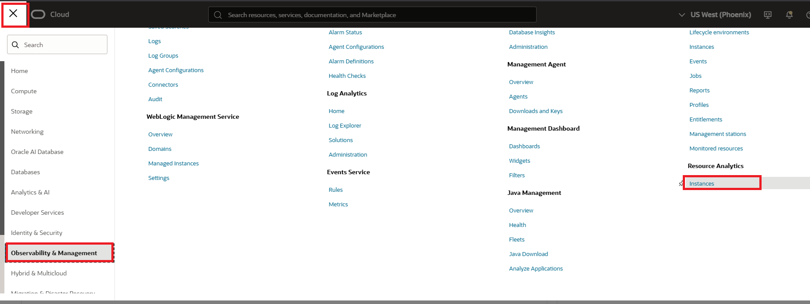
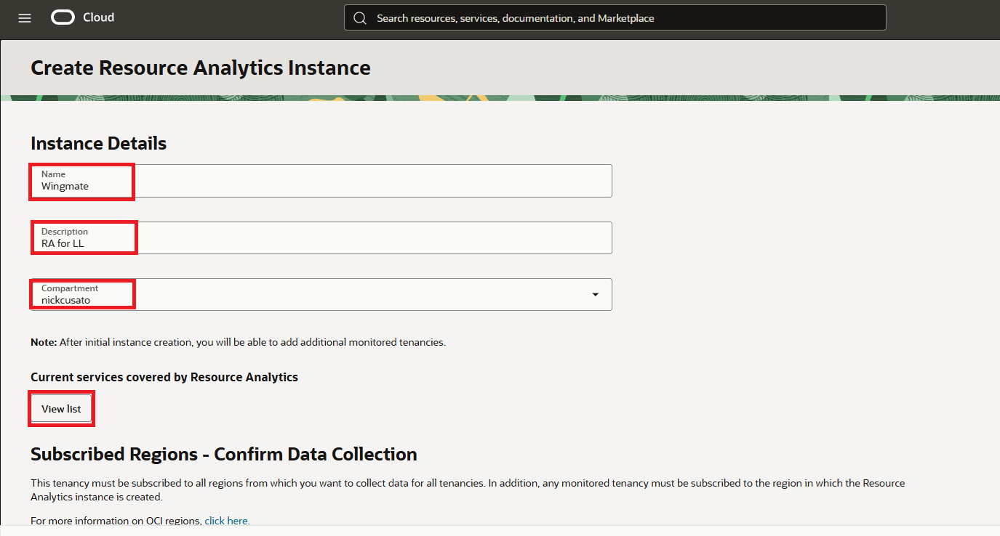
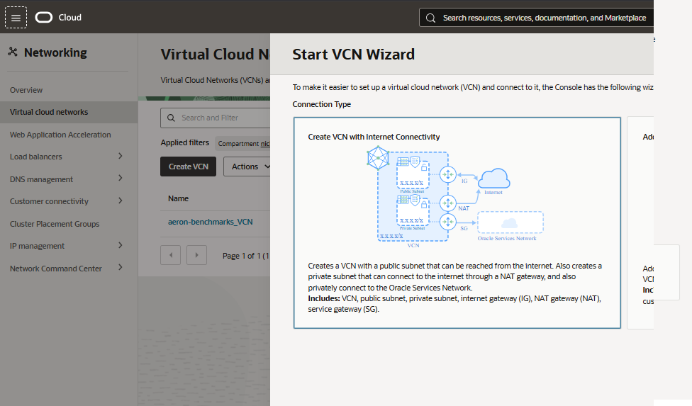
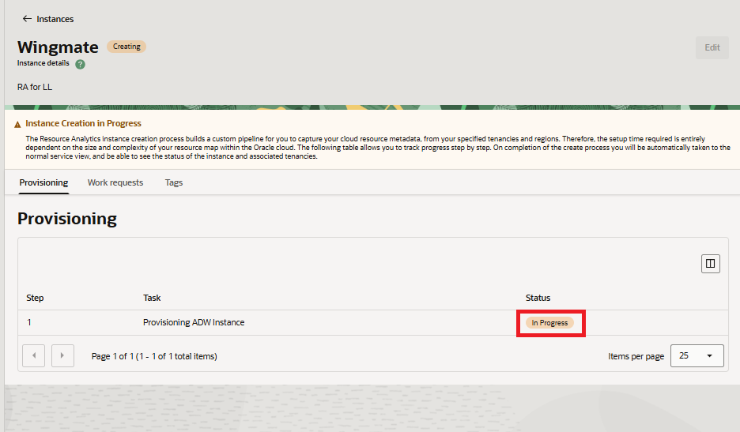

# Lab 4: Leverage Resource Analytics for a Data Pipeline

## Introduction

This lab walks the user through provisioning **Resource Analytics** for creating a data pipeline.

The first lab showed how to load synthetic data, as well as creating an API connection to live tenancy data that can bed fetched to help generate the visuals and reference with the Wingmate chatbot. This lab is unique because it creates a direct connection to the tenancy's resources. 

Estimated time - 20 minutes

### Objectives

* Provision Resource Analytics
* Connect pipeline to Wingmate

### Prerequisites

* Completed the previous labs
* Some SQL knowledge is perfered but not necessary

## Task 1: Provision Resource Analytics

1. Navigate to the OCI console and select the **hamburger menu** at the top left. Click the **Observability & Management** menu and scroll to **Resource Analytics**. Click **Instances**.

	

2. Notice the warning at the top, which requires the tenancy admin to perform the prerequisits listed in the documentation. Click **View Details** to perform those actions. Once completed, select **Create Instance**.

	

3. Provide a **Name**, **Description**, and select the correct **Compartment**. 

	>* **Note:** Click **View List** to see the services that you can connect to.

	

4. Select the **Regions** you want to collect data from. Additionally, select **Input Password** for the Autonomous Data Warehouse Admin Credentials and provide a **Password**.

	

	>* **Note**: IF you do not have a VCN, Navigate back to the **Hamburger Menu**, under **Networking** select **Virtual Cloud Networks**. Under the Actions button, use the **VCN Wizard** to create a VCN quickly with internet Connectivity.

	

5. 	Select a **VCN** and **Subnet**. Select **Create** at the bottom - leaving everything as default.

	

6. Wait for the Provisioning to be complete.

	

## Task 2: Connect pipeline to Wingmate

The Resource Analytics provisions an Autonomous AI Database in a private subnet. In order to view the data and import our Wingmate App, a VM in a public subnet is required to connect and access the Web SQL Developer. Installing NoVNC on the instance will allow for browser access. 

Thank you for completing this lab.

## Acknowledgements

* **Authors:**
	* Nicholas Cusato - Cloud Architect
	* Royce Fu - Master Principle Cloud Architect
* **Last Updated by/Date** - Nicholas Cusato, Febuary 2026