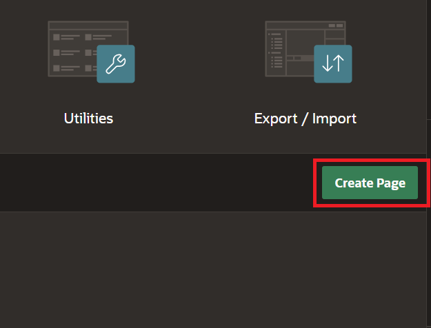
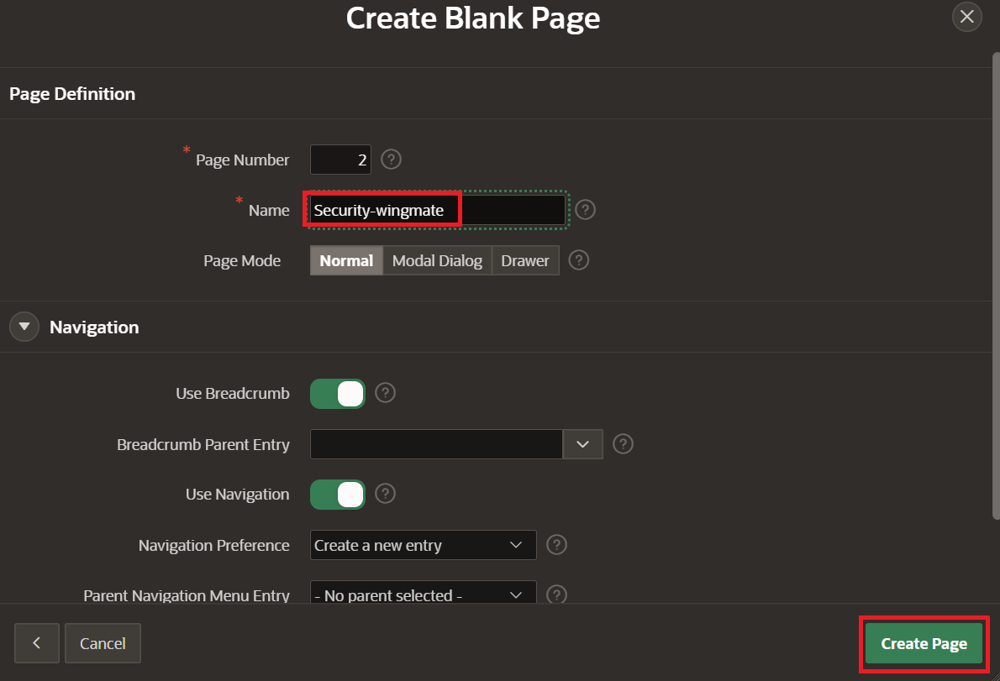
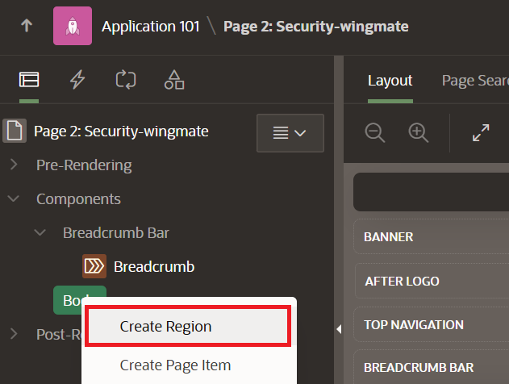
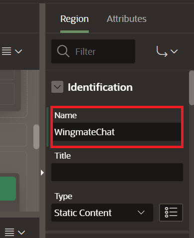
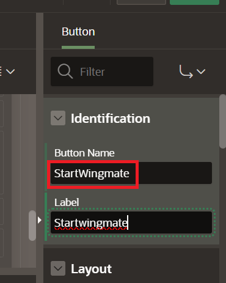

# Lab 2: Build Security Wingmate on APEX 

## Introduction
This lab will walk you through setting up the Security Wingmate page for the APEX application. Chat with your Wingmate about policies

Estimated time - 20 minutes

### Objectives

In this lab, you will:
* Build a Security Page of Wingmate App
* Load Synthetic Data to populate the App
* Test the App's Chat Feature

### Prerequisites

This lab assumes you have the following:

* Completed the previous lab
* Some SQL knowledge is perfered but not necessary

## Task 1: Build a Security Page of Wingmate App

1. Navitage to the APEX app WINGMATE, and select **Create Page**.

	

2. Leave the default blank page settings, and select **Next**.

	

3. Name the blank page **Security Wingmate** and select **Create Page**.

	

4. Right click **Body** on the application tree to the left and select **Create Region**.

	

5. On the right side panel under Identification for the region, Enter the name **WingmateChat**.

	

6. In the center of the App Builder, select the **Buttons** menu, and drag and drop the **text button** to the Region Body of WingmateChat region.

	

7. Name the button on the right panel **StartWingmate**.

	

8. On the left panel, right click the new button and select **Create Dynamic Action**.

	

9. On the left panel, right click the new button and select **Create Dynamic Action**.

	

## Task 2: Load Synthetic Data to populate the App

1. Download the SQL file for Multicloud DDL:

	[DDL for Security](https://oraclejamescalise.objectstorage.us-phoenix-1.oci.customer-oci.com/p/tyNihPYQjCiwbL3BDn-AyzU8YZSThfEoeX-yNcjp4tzNoan6ORP31LQpgoK3LyDq/n/oraclejamescalise/b/Wingmate-LL/o/security_ddl.sql)

2. Save the work done in the previous task by clicking the **Save Button** on the top right of the screen.

2. Navigate to the SQL

You may now **proceed to the next lab**.

## Acknowledgements

* **Authors:**
	* Royce Fu - Master Principle Cloud Architect
	* Nicholas Cusato - Cloud Architect
* **Last Updated by/Date** - Nicholas Cusato, Febuary 2026
