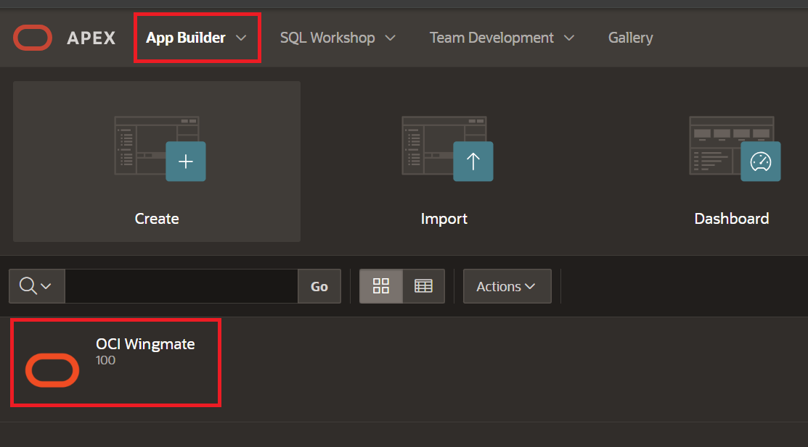
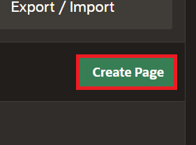
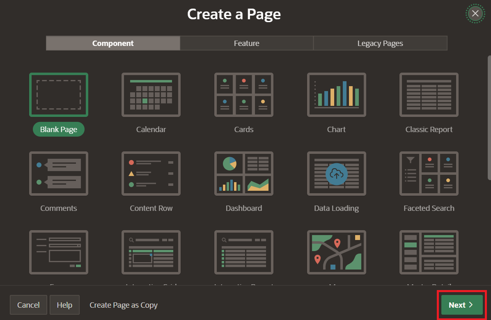
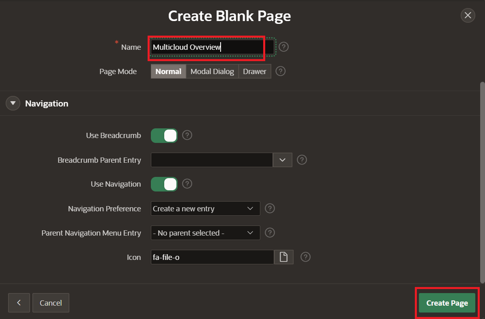

# Build a RAG Chatbot using Low-Code APEX

## Introduction

This lab walks the user through the creation of a multicloud Wingmate dashboard. This is helpful for managing compute and resources across multiple cloud service providors. 

Estimated time - 20 minutes

### Objectives

* Build a Multicloud Page of Wingmate App
* Load Synthetic Data to populate the App
* Test the App's Chat Feature

### Prerequisites

* An OCI cloud account
* Subscription to US-Central Chicago Region

## Task 1: Build a Multicloud Page of Wingmate App 

1. Return to the App homepage by selecting **App Builder** button, then select the name of the App **OCI Wingmate**.

	

2. Select **Create Page** to create the Multicloud Page.

	

3. Select **Next** leaving blank page as default.

	

4. Name the page **Multicloud Overview** and select **Next**.

	

Thank you for completing this lab.

## Acknowledgements

* **Authors:**
	* Royce Fu - Master Principle Cloud Architect
	* Nicholas Cusato - Cloud Architect
* **Last Updated by/Date** - Nicholas Cusato, October 2025