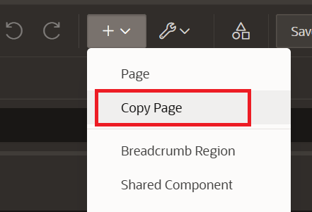
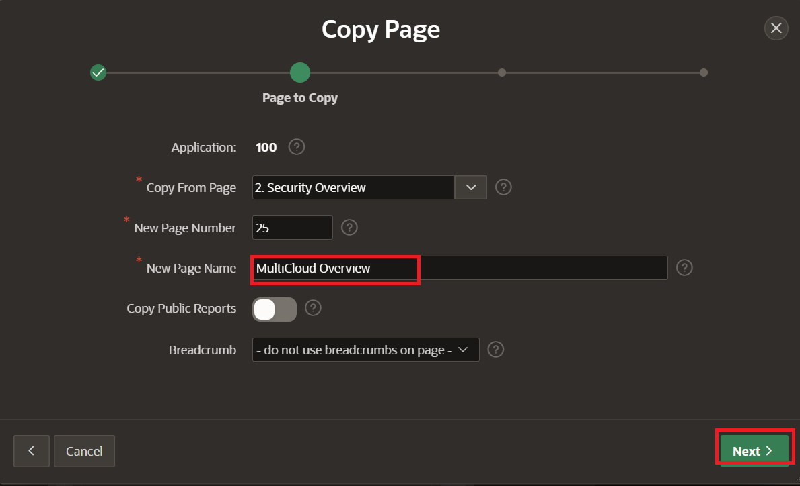

# Lab 3: Build a RAG Chatbot using Low-Code APEX

## Introduction

This lab walks the user through the creation of a multicloud Wingmate dashboard. This is helpful for managing compute and resources across multiple cloud service providors. 

Estimated time - 20 minutes

### Objectives

* Build a Multicloud Page of Wingmate App
* Load Synthetic Data to populate the App
* Test the App's Chat Feature

### Prerequisites

* Completed the first lab
* Some SQL knowledge is perfered but not necessary

## Task 1: Build a Multicloud Page of Wingmate App 

1. Use the existing template from Compute Wingmate to make the MultiCloud Wingmate by selecting the plus sign in the top right of the page and select **Copy Page**.

	

2. Select **Next** to use the existing page.

	

3. Name the page **MultiCloud Wingmate** and select **Next**.

	

4. Select **Create a new navigation menu entry** and **Next**. Leave menu entry as _No parent selected_.

	

5. 

Thank you for completing this lab.

## Acknowledgements

* **Authors:**
	* Royce Fu - Master Principle Cloud Architect
	* Nicholas Cusato - Cloud Architect
* **Last Updated by/Date** - Nicholas Cusato, Febuary 2026