# Lab 3: Build a RAG Chatbot using Low-Code APEX

## Introduction

This lab walks the user through the creation of a multicloud Wingmate dashboard. This is helpful for managing compute and resources across multiple cloud service providors. 

Estimated time - 20 minutes

### Objectives

* Build a Multicloud Page of Wingmate App
* Generate Report Period View
* Create Host Insights Widgets
* Compare Insights Across CPU and Memory
* Visualize CPU Combinations
* Use History to Predict CPU Forecast 
* Operationalize Multicloud with Graph
* Test the App's Chat Feature

### Prerequisites

* Completed the first lab
* Some SQL knowledge is perfered but not necessary

## Task 1: Build a Multicloud Page of Wingmate App 

1. Use the existing template from Compute Wingmate to make the MultiCloud Wingmate by selecting the plus sign in the top right of the page and select **Copy Page**.

	

2. Select **Next** to use the existing page.

	

3. Name the page **MultiCloud Wingmate** and select **Next**.

	

4. Select **Create a new navigation menu entry** and **Next**. Leave menu entry as _No parent selected_.

	

5. Rename Security to MultiCloud in the highlighted sections for value and static-id and select **Copy**.

	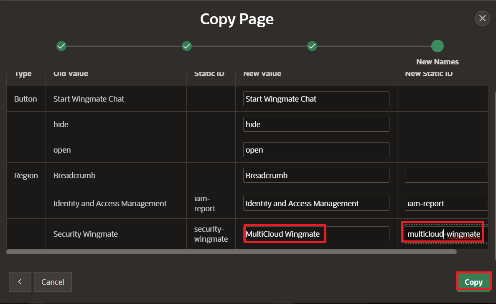

6. Update AI Assistant, by navigating to **Show AI Assistant** in the navigation tree under MultiCloud Wingmate Region -> StartWingmate -> Chat -> Show AI Assistant. Update System Prompt with following:

	```
	<copy/>
	I want you to be an OCI compute expert who is providing guidance to the customers about resource capacity planning best practices. 
	The following list is the oci compute host insights details we have captured, please use these compute metrics data for answering questions. 
	--------
	&P3_OCI_HOSTINSIGHTS_DETAILS.
	--------
	The following list is the OCI documentation references for compute, please use these documentation references for answering recommendation related questions.
	--------
	&P3_OCI_DOC_REF_COMPUTE.

	</copy>
	```

	>**Note:** Ensure you update the refence page number if its not matching. ie. &P3_OCI_DOC_REF_COMPUTE -> &P4_OCI_DOC_REF_COMPUTE

Update the **Welcome Message** from OCI Security Wingmate to OCI MultiCloud Wingmate as well.

7. Navigate to the bottom of the Navigation Tree to the hidden items. Select the OCI_CLOUDGUARD and rename it to **P4_OCI_HOSTINSIGHTS_DETAILS** on the right side Indentification. 

	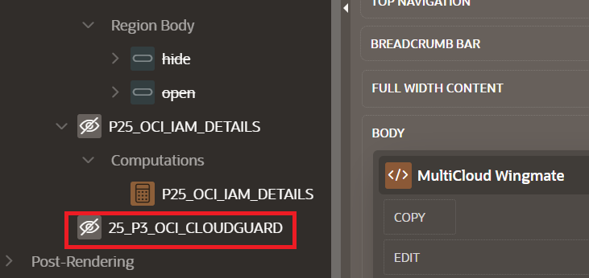

	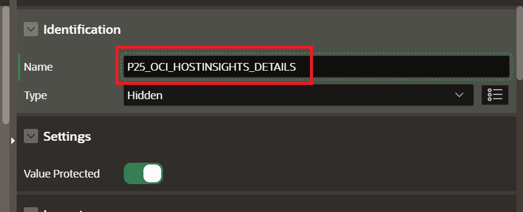

8. Update the computation as the following:

	```
	<copy/>
	Select CONTEXT_PROMPT FROM oci_doc_ref_compute_sv
	</copy>
	```

	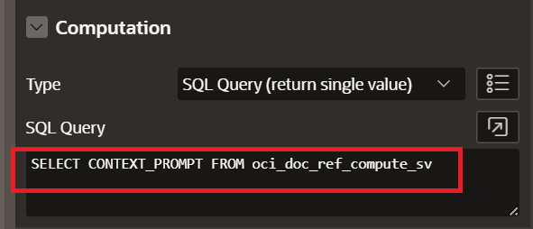

9. Create another **Hidden Item** by right clicking **P4_HOSTINSIGHTS_Listed**, selecting **Duplicate** and name it: **P4_OCI_HOSTINSIGHTS_DETAILS** 

	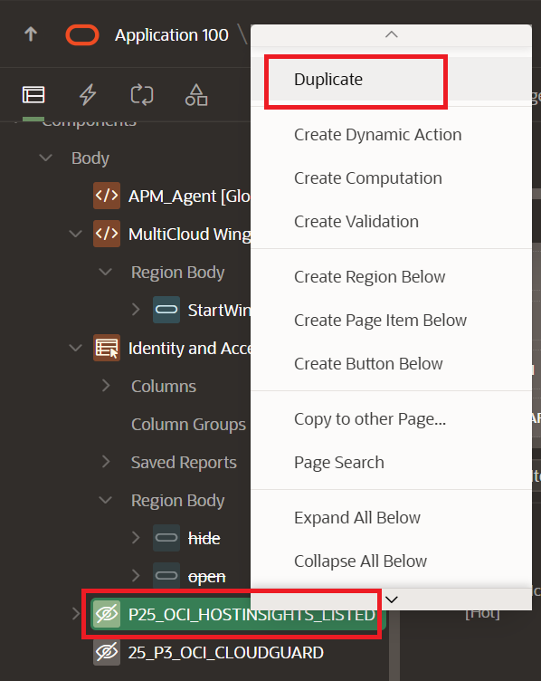

	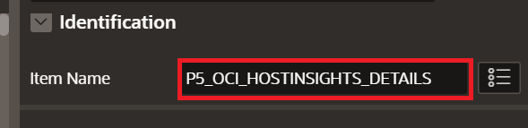

10. Right Click **P4_OCI_HOSTINSIGHTS_DETAILS** and select **Create Computation**. Paste this under **SQL Query** on the right side:

	```
	<copy/>
	Select CONTEXT_PROMPT FROM hostinsights_report_sv
	</copy>
	```

	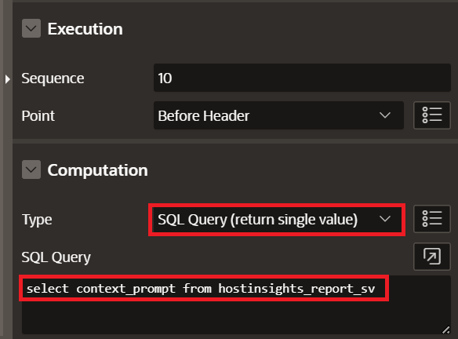

10. Repeat **Step 9** to create another hidden item named **P4_OCI_DATABASE_DETAILS**

	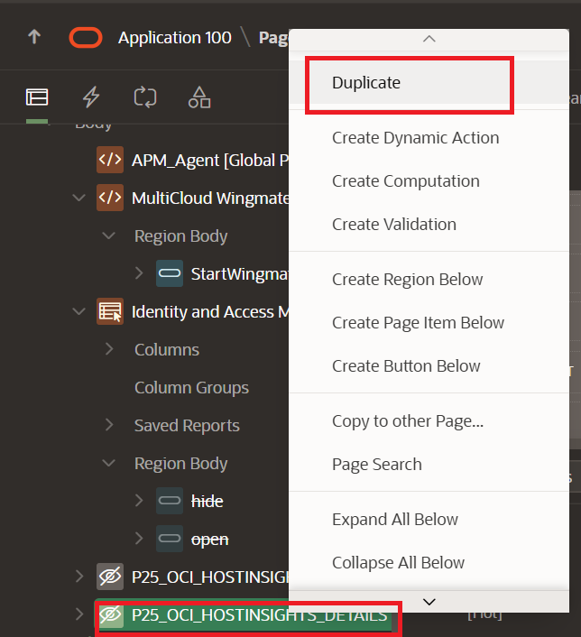

	

11. Right Click **P4_OCI_DATABASE_DETAILS** and select **Create Computation**. Paste this under SQL Query:

	```
	<copy/>
	SELECT CONTEXT_PROMPT FROM CIS_MULTICLOUD_DETAILS_V
	</copy>
	```

	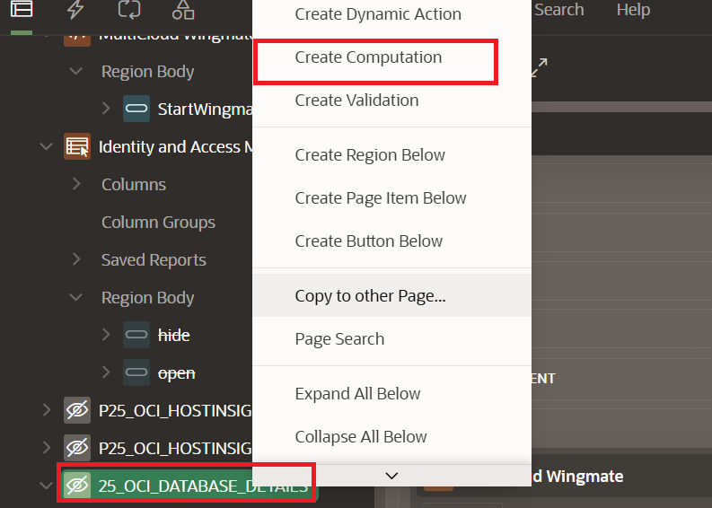

	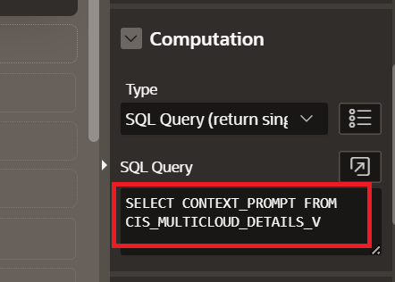

12. Create a table for viewing the host period by creating a region to contain it. Expand the **bottom module** (if not open) by selecting the arrow at the bttom center of the screen. Select **Regions** and pick the **Help** icon. Drop it under the Chat Region.

	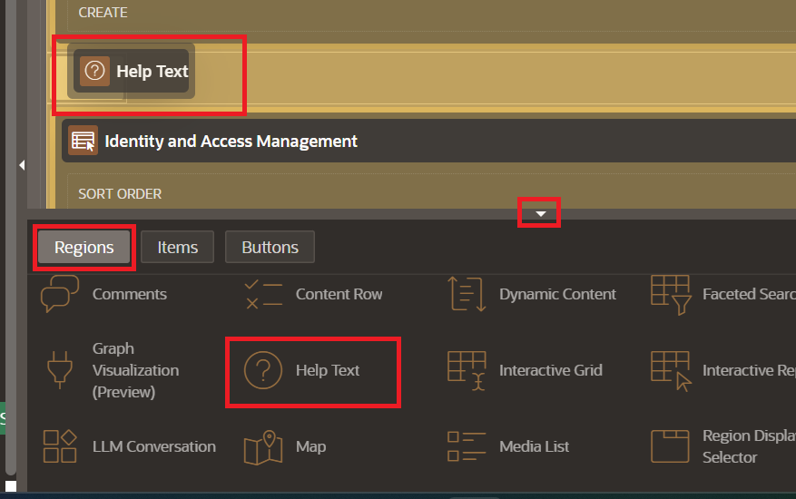

13. Name it **Host CPU Insights**.

	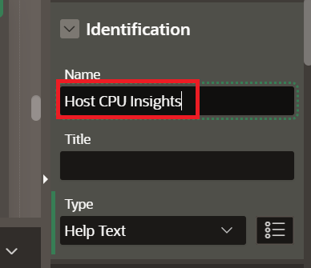

14. Drag and drop **Classic Report** into the body of the newly created region.

	

15. Name the Report **ReportPeriod** and select the table **HOSTINSIGHTS_REPORT_PERIOD**.

	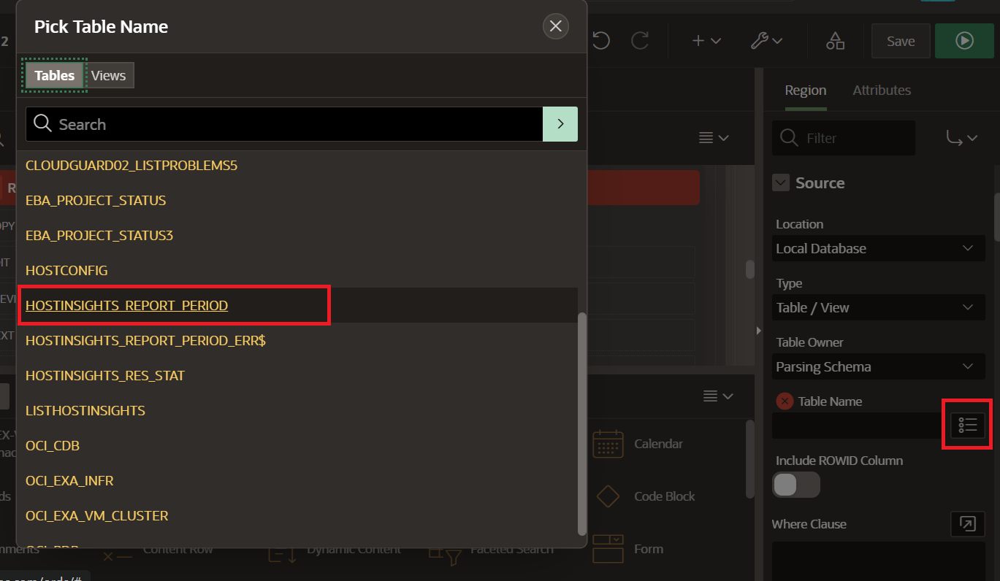

16. Expand the ReportPeriod columns by clicking **the arrow** and and right-click **USAGEUNIT** and **RESOURCEMETRIC**, selecting **Comment Out**

	

17. Drag and drop **Static Content** into the sub-region. Name the region **HOST INSIGHTS Metrics**.

	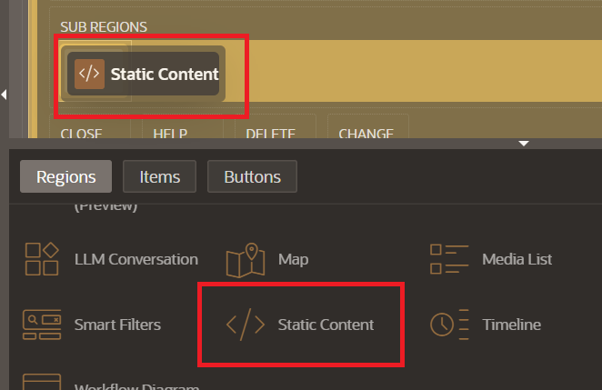

18. Drag and drop **Chart** in the sub region of the HOST INSIGHTS Metrics static content. Name it **CPU Usage over Capacity**

	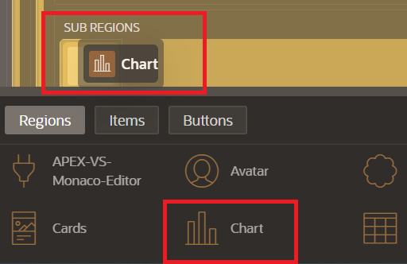

19. Select **Series** under the chart created and name it **CPU Metrics**. Change from Table/View to **SQL Query** and paste the following:

	```
	<copy>
	SELECT usage as cpu_usage, capacity as cpu_capacity FROM HOSTINSIGHTS_CPU_USAGE_SUMMARY
	</copy>
	```

	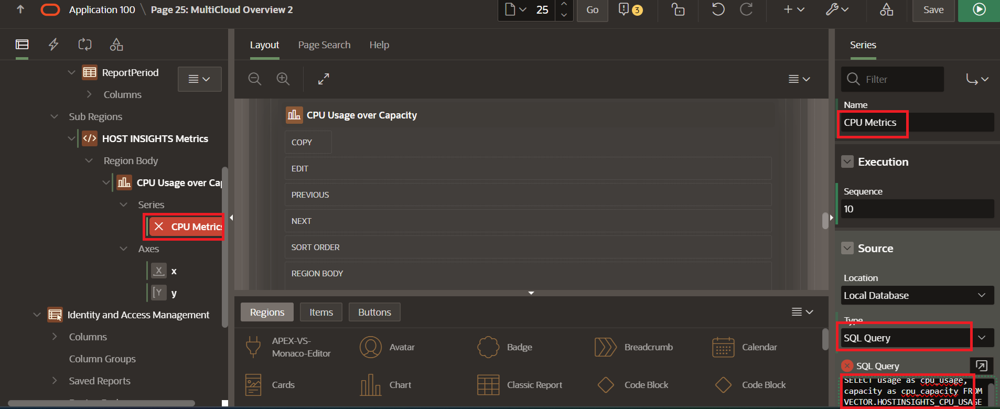

>***Note**: Add mapping with **CPU Usage** for Value and **CPU Capacity** for Maximum Value.  

20. Add another chat to the same sub Region by dragging and dropping **Chart** and naming it **Memory Usage over Capacity**. Select the **Series** and name it **Memory Usage**. Paste the following **SQL Query**:

	```
	<copy>
	SELECT usage as mem_usage, capacity as mem_capacity FROM HOSTINSIGHTS_MEMORY_USAGE_SUMMARY
	</copy>
	```

	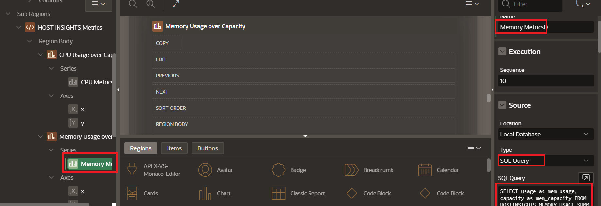

	>***Note**: Add mapping with **Memory Usage** for Value and **Memory Capacity** for Maximum Value. 

Next, Visuals for Host Insights across both CPU and Memory will be generated.

21. Drag and drop another **Static Region** into the same sub region as before. Name it **HOST INSIGHTS CPU and MEMORY**. Drag and drop 2 **Chart** Regions inside the body of the static content.

	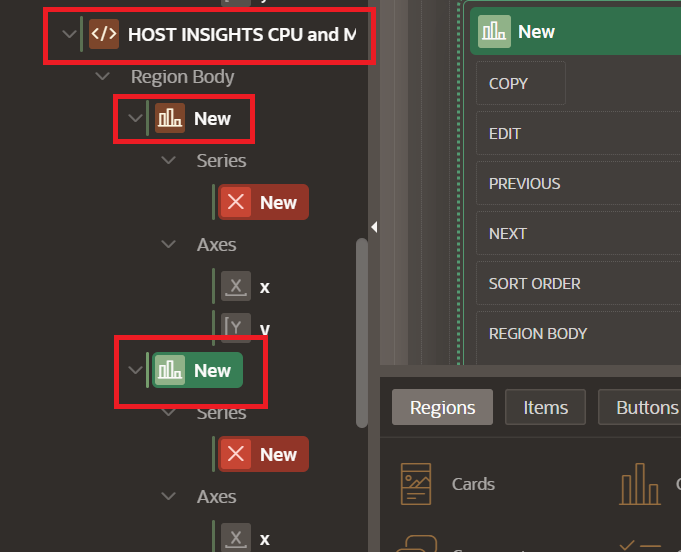

22. Name the first chart **CPU Usage across Host** and for the series, name it **Tasks**. Add the following **SQL Query**:

	```
	<copy>
	SELECT
    hostname,
    capacity,
    usage,
    average,
    usagechangepercent
	FROM
    hostinsights_res_stat
	</copy>
	```

	

	>***Note**: Select **HOSTNAME** for Label and **USAGE** for Value.

23. Name the second chart **Key Metrics Distribution** and update the series to include **CPU Utilization** and **Memory Utilization**. They both should have type **Line with Area**.
	* Update the **CPU Utilization SQL Query** to match:

	```
	<copy>
	select HOSTNAME, 
       UTILIZATIONPERCENT AS CPU_UTIL, 
       'CPU Utilization' as MetricType
	from HOSTINSIGHTS_RES_STAT
	</copy>
	```
	* Update the **Memory Utilization SQL Query** to match:
	```
	<copy>
	select HOSTNAME, 
       UTILIZATIONPERCENT AS MEM_UTIL, 
       'MEMORY Utilization' as MetricType
	from HOSTINSIGHTS_RES_STAT_MEMORY
	</copy>
	```

	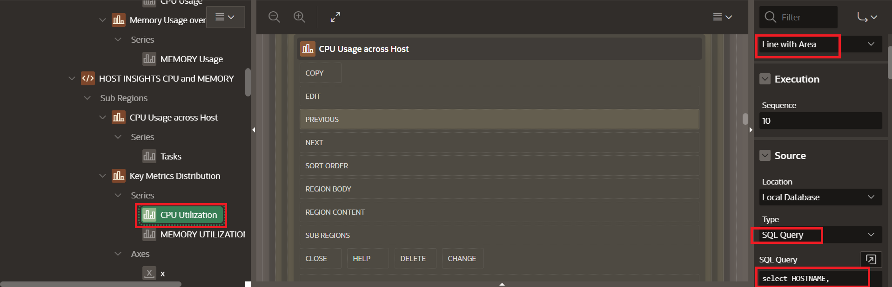

24. Right click **CPU Usage across Hosts** and select **Duplicate**. Rename it **Memory Usage across Hosts**.

>**Note:** Asjust the Regions to align each of the charts to be aligned on the horizontal axis. 

Thank you for completing this lab.

## Acknowledgements

* **Authors:**
	* Royce Fu - Master Principle Cloud Architect
	* Nicholas Cusato - Cloud Architect
* **Last Updated by/Date** - Nicholas Cusato, Febuary 2026