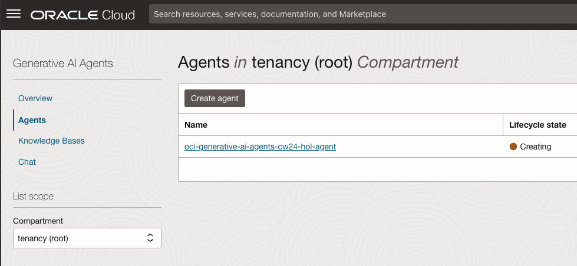
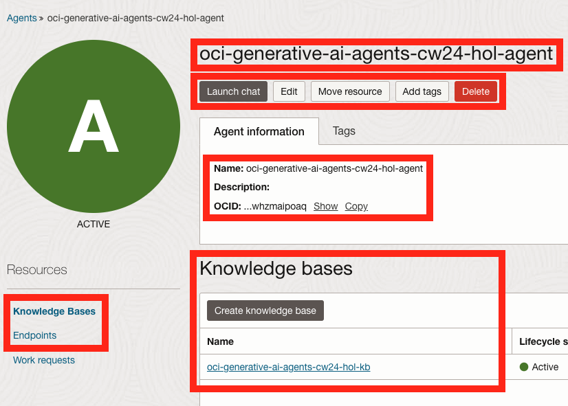

# Create an Agent

## Introduction

In the OCI Generative AI Agents service, an Agent holds a set of configuration which specifies the knowledge bases (can be more than one), a greeting preamble (more on this later) and an endpoint (a network access point which allows for communication with the Agent).
After an Agent is created, you will be able to chat with it and also make API calls against it's endpoint.

Estimated Time: 15 minutes

### Objectives

In this lab, you will:

* Create an Agent.
* Observe Agent metadata.

### Prerequisites

This lab assumes you have:

* An Oracle Cloud account
* All previous labs successfully completed

## Task 1: Create an Agent

1. From the OCI Generative AI Agents service overview page, click the **Agents** link on the left.

1. Make sure that the compartment created for you as part of the Sandbox environment is selected in the **Compartment** list under the **List scope** section on the left. See [Get Started](?lab=cloud-login-livelabs2) for help with locating the compartment name. Please note that you may have to expand the **root** and **LiveLabs** compartments in order to locate the right compartment.

1. Click the **Create agent** button at the top of the **Agents** table.

  

1. Provide a name for the Agent (for example: oci-generative-ai-agents-cw24-hol-agent)

1. Make sure that the compartment created for you as part of the Sandbox environment is selected in the **Compartment** list. See [Get Started](?lab=cloud-login-livelabs2) for help with locating the compartment name. Please note that you may have to expand the **root** and **LiveLabs** compartments in order to locate the right compartment.

1. Optionally, provide a **Welcome message** for the Agent to display at the start of a new conversation (also called the `Preamble`, for example: Hello, i'm the OCI Generative AI documentation helper! How can i help you today?).

1. Under the **Add knowledge bases** section, make sure that the compartment created for you as part of the Sandbox environment is selected in the **Compartments** list. See [Get Started](?lab=cloud-login-livelabs2) for help with locating the compartment name. Please note that you may have to expand the **root** and **LiveLabs** compartments in order to locate the right compartment.

1. Check the box next to the knowledge base we have created in the previous lab to let the Agent know it should interact with the data specified in the knowledge base.

1. Make sure that the **Automatically create an endpoint for this agent** option is checked.

1. Click the **Create** button at the bottom of the page.

  

If everything went to plan, your Agent will be created. This can take a few minutes.

Please wait until the **Lifecycle state** shows the **Active** state before moving on to the next lab.

  

  

## Task 2: Observe Agent metadata

1. After the Agent was created and we've confirmed that it's **Lifecycle state** is **Active**, click the Agent name in the **Agents** table.

  

1. Notable information on the Agent details page:

    1. Agent **name**.
    2. Agent **OCID**.
    3. **Knowledge Bases** associated with the Agent.
    4. **Endpoints** which can be used to access the Agent programmatically (a default one was created when we created the Agent).

    > In addition, you can **Launch a chat** session with the Agent as well as **Edit**, **Move** and **Delete** the Agent.

  

## Acknowledgements

* **Author** - Lyudmil Pelov, Senior Principal Product Manager, Yanir Shahak, Senior Principal Software Engineer
